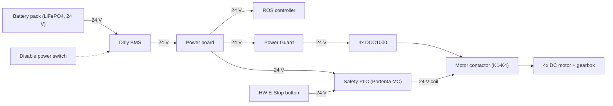
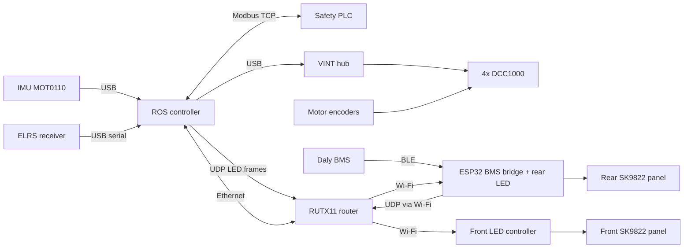

# Components

This page lists the main hardware blocks of the Rover A1 platform, how they connect, and where their datasheets are. For dimensions and performance figures see [Specification](specification.md).

## Component list

| # | Component | Model / part | Role | Interface / link |
|---|-----------|--------------|------|------------------|
| 1 | ROS controller | **TBD** (labelled `RPi` in the architecture diagram) | Runs the rover ROS 2 stack, `controller_manager` and all platform nodes | Ethernet to the safety PLC, Ethernet to the router, Wi-Fi, USB |
| 2 | Safety PLC | Arduino Portenta Machine Control | Holds the E-Stop latch, drives the motor contactor, runs the CPU watchdog, exposes 12 aux IO points | Modbus TCP, `192.168.88.11:502` |
| 3 | Motor contactor | **TBD** (drawn as relays K1–K4, one per motor) | Disconnects the motors from the drivers on an E-Stop. Its auxiliary contact is read back by the PLC | Coil driven by the PLC (24 V); feedback on `COIL_0` |
| 4 | Hardware E-Stop button | **TBD** (`PB1` / `E_BTN` in the diagram) | Trips the PLC latch | 24 V input to the PLC (`IX 0.0`), read as `CONTACT_0` |
| 5 | Motor controllers (4×) | Phidget DCC1000 | DC motor drive, encoder input, on-board failsafe | VINT hub ports 0, 1, 4, 5 (Phidget22 SDK) |
| 6 | VINT hub | **TBD** | Connects the four DCC1000 boards to the ROS controller | USB |
| 7 | Drive motors (4×) | **TBD** (DC motor with gearbox and encoder) | Wheel drive, one per wheel | Motor leads and encoder to its DCC1000 |
| 8 | IMU | Phidgets Spatial MOT0110 | Orientation, angular velocity, linear acceleration (Madgwick filter, magnetometer off) | USB |
| 9 | Battery management system | Daly BMS (model **TBD**) | Cell monitoring, protection, telemetry | BLE to the ESP32 bridge |
| 10 | BMS bridge / rear LED controller | ESP32, firmware `rover_led_bms_ble_controller` | Polls the BMS over BLE and forwards it over UDP. Also drives the rear LED panel | Wi-Fi, `192.168.77.201` |
| 11 | Battery pack | LiFePO4, 40 Ah, 24 V system (pack model and nominal voltage **TBD**) | Main power source | Through the BMS to the power board |
| 12 | LED panels (2×) | SK9822, 2 rows × 20 LEDs each | Front and rear bumper status lights | Wired to its LED controller |
| 13 | Front LED controller | **TBD** | Drives the front LED panel | Wi-Fi, UDP `192.168.77.202:3334` |
| 14 | RC receiver | ExpressLRS (CRSF), model **TBD** | Radio teleop and software E-Stop switches | USB serial `/dev/ttyUSB0`, 460800 baud |
| 15 | Router | RUTX11 Wi-Fi / GSM / GPS router | Platform LAN and Wi-Fi access point | Ethernet to the ROS controller, Wi-Fi to the LED/BMS controllers |
| 16 | Power board and Power Guard | **TBD** | 24 V distribution. The Power Guard feeds the motor drivers | 24 V |

Sources: `rover_arch/rover_a1_arch.drawio`, `rover_safety/README.md`, `rover_msgs/msg/AuxIoState.msg`, `rover_description/urdf/rover_a1/rover_a1_macro.urdf.xacro`, `rover_arch/SAFETY_CHAIN.md`, `rover_hardware_interface/src/rover_driver/rover_a1_driver.cpp`, `rover_hardware_interface/README.md`, `rover_description/urdf/common/imu.urdf.xacro`, `rover_battery/README.md`, `rover_led/config/rover_a1_udp_led_channel_2.yaml`, `rover_battery/config/rover_battery.yaml`, `rover_led/README.md`, `rover_led/config/rover_a1_driver.yaml`, `rover_led/config/rover_a1_udp_led_channel_1.yaml`, `rover_crsf_teleop/config/rover_crsf_teleop.yaml`.

The lidar and GNSS receiver are part of the sensor payload. They are documented in the `rover_sensors` repository, not here.

!!! note "Motor contactor drawing"
    `SAFETY_CHAIN.md` describes one contactor with an auxiliary contact. The electrical schematic in `rover_a1_arch.drawio` draws four relays (K1–K4), one in series with each motor, with their coils in parallel on PLC output `QX 0.0`, and does not show the auxiliary contact.

## Wheels and drivetrain

The A1 is a four-wheel-drive skid-steer platform. Each wheel has its own motor, gearbox, encoder and DCC1000. The ROS side drives it as a differential drive (`diff_drive_controller` on top of four wheel PID controllers).

| Item | Value | Source |
|------|-------|--------|
| Drive layout | 4WD skid-steer, one motor per wheel | `rover_controller/config/wheel_01_controller.yaml` |
| Wheel type | Non-mecanum (`mecanum: False`), CAD part `WHEEL_CHUNK_1000_WATT_VARIANT`; tyre type **TBD** | `rover_description/config/wheel_01.yaml` |
| Tyre radius (CAD) | 0.1699 m | `rover_description/config/wheel_01.yaml` |
| Effective rolling radius (odometry) | 0.1651 m | `rover_description/config/wheel_01.yaml`, `rover_controller/config/wheel_01_controller.yaml` |
| Wheel width | 0.108 m | `rover_description/config/wheel_01.yaml` |
| Gear ratio | 23.3 | `rover_a1_macro.urdf.xacro` (`gear_ratio`) |
| Gearbox efficiency | 0.70 | `rover_a1_macro.urdf.xacro` (`gearbox_efficiency`) |
| Encoder resolution | 1024 lines per motor revolution (the driver counts 4 edges per line) | `rover_a1_macro.urdf.xacro` (`encoder_resolution`), `rover_hardware_interface/src/domain/driver_data_snapshot.cpp`, `phidget_motor_driver.cpp` |
| Max motor speed | 2800 rpm | `rover_a1_macro.urdf.xacro` (`max_rpm_motor_speed`) |
| Motor torque constant | 0.11 N·m/A | `rover_a1_macro.urdf.xacro` (`motor_torque_constant`) |
| Motor stall current | 16 A at 24 V | comment on `motor_current_limit` in `rover_a1_macro.urdf.xacro` |
| DCC1000 current limit | 15 A | `rover_a1_macro.urdf.xacro` (`motor_current_limit`) |
| DCC1000 on-board ramp | 1.0 duty/s | `rover_a1_macro.urdf.xacro` (`motor_acceleration`) |
| DCC1000 failsafe timeout | 500 ms | `rover_a1_macro.urdf.xacro` (`motor_failsafe_timeout_ms`) |

The tyre radius and the odometry radius differ on purpose. The CAD radius places the model on the ground. The odometry radius is the one the controllers are tuned on.

| Wheel | Joint | VINT hub port | Direction reversed | Source |
|-------|-------|---------------|--------------------|--------|
| Front left | `fl_wheel_base_to_fl_wheel_joint` | 0 | yes | `rover_hardware_interface/src/rover_driver/rover_a1_driver.cpp` |
| Front right | `fr_wheel_base_to_fr_wheel_joint` | 1 | no | same |
| Rear left | `rl_wheel_base_to_rl_wheel_joint` | 4 | yes | same |
| Rear right | `rr_wheel_base_to_rr_wheel_joint` | 5 | no | same |

The motor model and power rating are **TBD**. Control loop details are in [Drive and control](../software/drive-and-control.md).

## Block diagram

The diagrams are redrawn from the "Rover A1 System Definition" and network pages of `rover_arch/rover_a1_arch.drawio`, then checked against the code. Where the two disagree, the diagram follows the code (see the warning below).

### Power

Source: `rover_arch/rover_a1_arch.drawio` (System Definition and Electrical Schematic pages). How the LED controllers, the router and the IMU are powered is **TBD**.

### Data

Source: `rover_arch/rover_a1_arch.drawio`, `rover_battery/README.md`, `rover_led/README.md`, `rover_crsf_teleop/README.md`, `rover_hardware_interface/README.md`. Addresses and ports are on [IO and network](io-and-network.md).

!!! warning "Source conflict"
    The diagram `rover_arch/rover_a1_arch.drawio` connects the battery monitor to the controller over **RS485/RS232** (node `battery_monitor` on a serial port). The code receives BMS data over **UDP** from the ESP32 bridge, which reads the Daly BMS over BLE (`rover_battery/README.md`, `rover_battery/launch/rover_battery.launch.py`). This page follows the code. The drawio software page also still shows the removed `/hardware_interface/gpio_state` topic and `GpioController`.

## Datasheets and protocol documents

| Document | Covers |
|----------|--------|
| [DCC1000_reference.pdf](https://github.com/RaduPotlog/rover_ros/blob/master/rover_hardware_interface/docs/DCC1000_reference.pdf) | Phidget DCC1000 DC motor controller |
| [MOT0110_reference.pdf](https://github.com/RaduPotlog/rover_ros/blob/master/rover_hardware_interface/docs/MOT0110_reference.pdf) | Phidgets Spatial MOT0110 IMU |
| [Part 3 - Daly CAN Protocol.pdf](https://github.com/RaduPotlog/rover_ros/blob/master/rover_battery/docs/Part%203%20-%20Daly%20CAN%20Protocol.pdf) | Daly BMS CAN protocol |
| [Part 4 - Daly RS485+UART Protocol.pdf](https://github.com/RaduPotlog/rover_ros/blob/master/rover_battery/docs/Part%204%20-%20Daly%20RS485%2BUART%20Protocol.pdf) | Daly BMS RS485/UART protocol (data units used by the bridge) |

Datasheets for the Portenta Machine Control, the motors, the ELRS receiver, the VINT hub and the router are not in the repository (**TBD**).

Further reading: [rover_hardware_interface README](https://github.com/RaduPotlog/rover_ros/blob/master/rover_hardware_interface/README.md), [rover_description README](https://github.com/RaduPotlog/rover_ros/blob/master/rover_description/README.md), [rover_arch README](https://github.com/RaduPotlog/rover_ros/blob/master/rover_arch/README.md).
