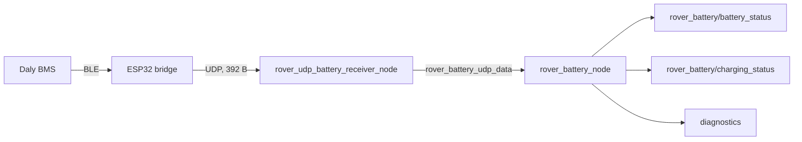

# Power and battery

The A1 runs from a 24 V LiFePO4 pack with a Daly BMS. This page covers the pack, the telemetry chain into ROS 2, the battery thresholds that trip the E-Stop or change the LEDs, and how the ROS controller shuts down.

ROS names on this page are relative to the robot namespace `rover`. For example, `rover_battery/battery_status` is `/rover/rover_battery/battery_status`.

## Battery

| Item | Value | Source |
|------|-------|--------|
| Chemistry | LiFePO4 (`POWER_SUPPLY_TECHNOLOGY_LIFE`) | `rover_battery/src/infrastructure/battery_msg_conversions.cpp`; drawio label `LiPoFe4` |
| Nominal voltage | 24 V | `rover_arch/rover_a1_arch.drawio` (battery and power board links) |
| Design capacity | 40 Ah | `rover_battery/config/rover_battery.yaml` (`design_capacity`) |
| Reported serial number | `224KA141600043` | `rover_battery/config/rover_battery.yaml` (`serial_number`) |
| Cell count | Reported by the BMS at runtime; pack value **TBD** | `rover_battery/include/rover_battery/domain/bms_frame.hpp` |
| BMS | Daly, model **TBD** | `rover_battery/README.md` |
| Main switch | "Disable Power Switch" on the battery monitor; part and location **TBD** | `rover_arch/rover_a1_arch.drawio` |
| Runtime | **TBD** (no measured figure on hardware) | none |

!!! note "Simulation values"
    `rover_description/config/battery.yaml` and `urdf/common/battery.urdf.xacro` configure the Gazebo `LinearBatteryPlugin`. They are **simulation only** and do not describe the real pack: 40 Ah, 70 % initial charge, 8 h charging time, 160 W constant load ("about 6 hours"), 41.4 V.

!!! warning "Source conflict"
    The simulated battery uses 41.4 V (`rover_description/urdf/common/battery.urdf.xacro`). The real platform is 24 V (`rover_arch/rover_a1_arch.drawio`, `motor_supply_voltage` 24.0 in `rover_description/urdf/rover_a1/rover_a1_macro.urdf.xacro`). Only the simulation uses 41.4 V.

## Power distribution

The pack feeds the BMS, which feeds the power board. The power board supplies 24 V to the ROS controller, the safety PLC and the Power Guard. The Power Guard feeds the four motor drivers. The motor contactor sits between the drivers and the motors, so an E-Stop cuts the motors while the computers stay powered. See the power diagram on [Components](components.md#power).

| Item | Value | Source |
|------|-------|--------|
| Motor supply voltage | 24 V | `rover_a1_macro.urdf.xacro` (`motor_supply_voltage`) |
| DCC1000 supply range | 8–30 V | comment on `motor_supply_voltage` in `rover_a1_macro.urdf.xacro` |
| Motor current limit (per DCC1000) | 15 A | `rover_a1_macro.urdf.xacro` (`motor_current_limit`) |
| Motor stall current | 16 A at 24 V | comment on `motor_current_limit` in `rover_a1_macro.urdf.xacro` |
| Current regulator gain | `motor_current_limit × motor_supply_voltage / 12` | comment in `rover_a1_macro.urdf.xacro` |
| Power board, Power Guard, fuses | **TBD** | none |

## Telemetry chain

The ESP32 bridge (firmware `rover_led_bms_ble_controller`, outside this repository) polls the Daly BMS over BLE. It converts the raw Daly units and sends a 392-byte frame over UDP. On the ROS controller, `rover_udp_battery_receiver_node` receives it and `rover_battery_node` decodes it. Both run in one container, `rover_battery_container`, with intra-process communication.



| Item | Value | Source |
|------|-------|--------|
| UDP endpoint (bind address on the ROS controller) | `192.168.1.201:4444` | `rover_battery/config/rover_battery.yaml` |
| Payload | 392 bytes (385 data + 7 alarm bytes) | `rover_battery/include/rover_battery/domain/bms_frame.hpp` |
| BMS watchdog | 10000 ms without a valid frame | `rover_battery/config/rover_battery.yaml` (`watchdog_timeout_ms`) |
| Frame rate from the bridge | **TBD** (set by the ESP32 firmware) | none |

| Topic | Type | QoS | Content |
|-------|------|-----|---------|
| `rover_battery/battery_status` | `sensor_msgs/BatteryState` | depth 5 | Voltage, current, SoC, residual charge (Ah), hottest temperature sensor, cell voltages (V), status, health |
| `rover_battery/charging_status` | `rover_msgs/ChargingStatus` | depth 5 | `charging` (BMS status 1), pack current, charger type `WIRED` while charging |
| `diagnostics` | `diagnostic_msgs/DiagnosticArray` | default | Hardware id `RoverBattery`: tasks `Battery errors`, `Battery status` |

Source: `rover_battery/src/infrastructure/ros2_battery_state_publisher.cpp`, `rover_battery/src/domain/battery_classifier.cpp`.

Status and health mapping in `rover_battery`:

| BatteryState field | Rule |
|--------------------|------|
| `power_supply_status` | BMS status 0 → `NOT_CHARGING`, 1 → `CHARGING` (`FULL` at 100 % SoC), 2 → `DISCHARGING`, other → `UNKNOWN` |
| `power_supply_health` `DEAD` | Level-1 low pack voltage, low cell voltage or low SoC alarm |
| `power_supply_health` `OVERVOLTAGE` | Level-2 high pack voltage or high SoC alarm |
| `power_supply_health` `OVERHEAT` / `COLD` | Level-1 charge or discharge temperature alarm (overrides the voltage verdict) |
| `temperature` | Hottest sensor (`tempMax`), so one hot cell is enough to trip a threshold |
| `capacity` | NaN: the BMS does not report the last full capacity |

Source: `rover_battery/src/domain/battery_classifier.cpp`.

The bridge sends an all-zero frame when it has no BMS data. The node ignores that frame and wrong-size packets. After 10 s without a valid frame it publishes `present: false`, health `WATCHDOG_TIMER_EXPIRE`, status `UNKNOWN`, and NaN for charge, capacity and percentage.

!!! warning
    A silent BMS trips the software E-Stop. The watchdog state maps to health `WATCHDOG_TIMER_EXPIRE`, and `rover_safety` answers that with `TRIP_E_STOP` (see below). If the ESP32 bridge or its Wi-Fi link is down for 10 s, the rover stops.

More detail: [rover_battery README](https://github.com/RaduPotlog/rover_ros/blob/master/rover_battery/README.md).

## Battery thresholds

### Safety reactions (`rover_safety_node`)

`rover_safety_node` reads `rover_battery/battery_status` and decides a verdict every tick (10 Hz). It runs on hardware only, not with `use_sim:=True`.

| Battery reading | Verdict | Effect |
|-----------------|---------|--------|
| Health `WATCHDOG_TIMER_EXPIRE`, `DEAD` or `OVERVOLTAGE` | `TRIP_E_STOP` | Calls `hardware_interface/sw_user_e_stop_set` |
| Health `OVERHEAT` and temperature above 60.0 °C (`battery.temp.fatal`) | `SHUTDOWN` | Starts the shutdown sequence below |
| Health `OVERHEAT` and temperature above 50.0 °C (`battery.temp.critical`) | `TRIP_E_STOP` | Calls `hardware_interface/sw_user_e_stop_set` |
| Anything else | none | none |

Source: `rover_safety/src/domain/battery_safety_policy.cpp`, `rover_safety/config/rover_safety.yaml`.

The temperature limits apply only when the BMS has raised an overheat alarm. `rover_safety` does not trip on low SoC by itself: low SoC acts through the BMS `DEAD` health. The CPU and driver temperature parameters in `rover_safety.yaml` (`cpu.temp.*`, `driver.temp.*`) are declared but not used.

### LED indications (`rover_led_safety_node`)

| Condition | Animation | Source parameter |
|-----------|-----------|------------------|
| Discharging, SoC below 10 % | `CRITICAL_BATTERY` | `battery.percent.threshold.critical: 0.1` |
| Discharging, SoC from 10 % up to 40 % | `LOW_BATTERY`, repeated every 30 s | `battery.percent.threshold.low: 0.4`, `battery.anim_period.low: 30.0` |
| Discharging, SoC at or above 40 % | `BATTERY_NOMINAL` | same |
| Charging or full | `CHARGER_INSERTED`, then `CHARGING_BATTERY` (SoC rounded to 5 % steps), `BATTERY_CHARGED` at 100 % | `battery.charging_anim_step: 0.05` |
| Status `UNKNOWN` (includes the BMS watchdog) | `ERROR` | none |
| Charging and health `OVERHEAT` | `ERROR` | none |

Source: `rover_safety/config/led_safety.yaml`, `rover_safety/README.md`. The animations themselves are described in [Teleop and LEDs](../software/teleop-and-leds.md).

## Shutdown and power-down

`rover_safety_node` shuts down the ROS controller (the computer, not the battery) when the battery verdict is `SHUTDOWN`, or when anything calls its service:

```bash
ros2 service call /rover/rover_safety_node/shutdown std_srvs/srv/Trigger {}
```

The `RoverShutdown` behavior tree then runs:

1. Trip the software E-Stop (`hardware_interface/sw_user_e_stop_set`), best effort.
2. Ask each host in `config/shutdown_hosts.yaml` to shut down. The shipped list is empty.
3. Run `shutdown_ros_controller.sh --no-e-stop`, which powers off through the balena Supervisor API, systemd-logind over D-Bus, or `systemctl poweroff`, in that order.

| Parameter | Value | Source |
|-----------|-------|--------|
| `shutdown.command_timeout` | 15.0 s | `rover_safety/config/rover_safety.yaml` |
| `shutdown.retry_backoff` | 30.0 s | same |
| `shutdown.service_enabled` | `true` | same |

The script can also be run by hand when the ROS stack is down: `ros2 run rover_safety shutdown_ros_controller.sh --reason "Maintenance"`.

!!! note
    The sequence powers off the ROS controller only. The safety PLC, the power board, the motor drivers, the LED controllers and the router stay powered. The ESP32 bridge can be added to `shutdown_hosts.yaml` (example address `192.168.77.201`, port 3003), but no host is configured. How to cut main power, and the safe power-down order for the remaining devices, are **TBD**.

More detail: [rover_safety README](https://github.com/RaduPotlog/rover_ros/blob/master/rover_safety/README.md), [Safety](../safety.md).

## Charging

`rover_battery` reports charging from the BMS charge/discharge status and marks the charger as `WIRED`. The charger model, charging voltage and current, charge connector, charging time and charging procedure are **TBD**: none of them are in the repository.

Source: `rover_battery/src/domain/battery_classifier.cpp`.
