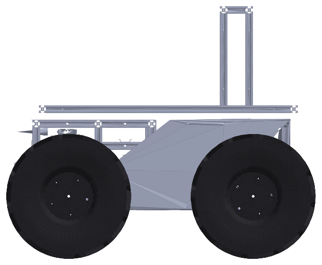
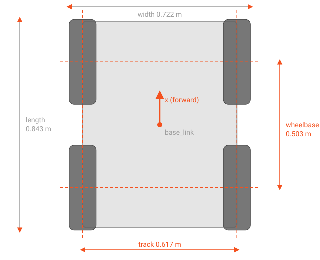

# Specification

The technical parameters of the Rover A1 platform. Every value cites the file it comes from.
A value marked **derived** is computed from those files, and the formula is given. A value marked
**TBD** is not yet defined anywhere in the repository; see [Open items](../open-items.md).

{ width="420" }
{ width="420" }

## Basic parameters

| Parameter | Value | Notes |
|---|---|---|
| Drive | 4WD skid-steer, 4 driven wheels, no steering | Commanded as a differential drive (body twist) |
| Overall length × width × height | 0.843 × 0.722 × 0.688 m | **Derived** from the URDF meshes (wheels included, top of the front arch); payload sensors not included |
| Body length × width | 0.823 × 0.617 m | **Derived**, `base.stl` bounds |
| Wheelbase (front to rear axle) | 0.503 m | |
| Track (wheel centre to wheel centre) | 0.617 m | See the warning below |
| Ground clearance | 0.113 m | **Derived**: lowest point of `base.stl` above the ground; not measured |
| Height of `base_link` above ground | 0.1325 m | **Derived**: `tyre_radius` − `wheel_mount_point_z` (0.1699 − 0.037363) |
| Mass (CAD, with batteries, without payload) | 57.27 kg | SolidWorks mass properties (2026-10-07), equal to the URDF total; requirement ≤ 60 kg (SYS-SR-001) |
| Centre of mass height | 0.215 m above ground | CAD (2026-10-07), in the URDF frame: 0.0825 m above `body_link` + 0.1325 m |
| Yaw moment of inertia | 6.17 kg·m² | CAD (2026-10-07), about the centre of mass |
| Static sideways tip-over angle | about 55° | **Derived**: atan(0.3068 / 0.215) with the tyre contact half-track, level ground, no payload, no dynamics |
| Payload | **TBD** | SYS-SR-027 |
| Maximum slope | **TBD** | SYS-SR-028 |
| Operating temperature | **TBD** | SYS-SR-029 |
| Ingress protection (IP rating) | **TBD** | SYS-SR-029 |
| Nav 2 footprint | 0.923 × 0.802 m | CAD tyre outline + 0.04 m; it lives in the navigation config outside rover_ros |

!!! warning "Source conflict: track width"
    The URDF and the drive controller use `wheel_separation: 0.617` m. The comment in
    `rover_controller/config/wheel_01_controller.yaml` and the MBSE data say the measured track
    is 0.615 m. The manual uses 0.617 m, the value the code runs with.

Sources: `rover_description/config/wheel_01.yaml`,
`rover_description/urdf/rover_a1/rover_a1_macro.urdf.xacro` (`wheel_mount_point_z`),
the SolidWorks mass properties of ROVER_1000_WATT_VARIANT (2026-10-07 export: mass, centre of
mass, inertia),
`rover_description/meshes/` (dimensions computed by `docs/tools/render_meshes.py`),
`rover_platform_mbse/system/ROVER-A1-ROVER_ROS_SYS-SR-V-002.xlsx` (sheets *Requirements*
and *Mass Properties*), `rover_platform_mbse/data/sys_sr_compliance.json` (Nav 2 footprint).

## Wheels

| Parameter | Value |
|---|---|
| Wheel | 13 in |
| Tyre radius (CAD geometry) | 0.1699 m |
| Effective rolling radius (odometry) | 0.1651 m |
| Wheel width | 0.108 m |
| Wheel mass | 5.074 kg each |
| Wheel joint limits | 64.5 N·m, 10.958 rad/s |

The odometry uses the effective radius, which is smaller than the CAD radius: the tyre deflects
under load. The CAD radius sets the wheel collision cylinder and the height of `base_link`.

Sources: `rover_description/config/wheel_01.yaml`, `rover_description/README.md` (13-inch wheel),
`rover_description/urdf/common/wheel.urdf.xacro`.

## Traction

| Parameter | Value | Notes |
|---|---|---|
| Maximum linear speed | 0.95 m/s | Forward and reverse, controller limit |
| Maximum angular speed | 1.5 rad/s | Controller limit |
| Linear acceleration / deceleration | 2.7 m/s² | |
| Angular acceleration / deceleration | 3.74 rad/s² | |
| Velocity command timeout | 0.5 s | The drive controller stops when `cmd_vel` goes quiet |
| Maximum wheel speed | 10.958 rad/s | URDF joint limit; 1.81 m/s at the rim (**derived**, × 0.1651 m) |
| Motors | 4 × DOBTIAN 250 W, 24 V brushed DC gear motor with MT6835 encoder | One per wheel; 120 RPM at the output shaft (2800 rpm ÷ 23.3). Seller listing: "250w low speed brush motor" (Dobtian); identifier 254324557 (from the owner). See [Components](components.md) |
| Motor rated speed | 2800 rpm | |
| Motor rated voltage / current | 24 V / 13.4 A | Seller listing, not a datasheet. The 15 A driver limit is 112 % of the rated current. Four motors at rated current would draw about 54 A (about 1.3 kW) |
| Gear ratio | 23.3 : 1 | Gearbox efficiency 0.70 |
| Motor torque constant | 0.11 N·m/A | |
| Motor current limit | 15 A | Per motor controller; see the open items |
| Encoder resolution | 1024 counts | Per motor revolution |
| Motor controllers | 4 × Phidget DCC1000 | See [Components](components.md) |
| Drive control rate | 50 Hz | `controller_manager` update rate |

The linear and angular limits are applied independently. A full-speed turn while driving at
full speed can ask the outer wheels for more than they can give; the reasoning is in the comment
above the limits in `wheel_01_controller.yaml`.

!!! note "SYS-SR-004"
    The requirement sets the linear limit at 1.0 m/s. The answer for the angular limit in the
    requirements spreadsheet reads "1.7 m/s2". The code limits the angular speed to 1.5 rad/s.

Sources: `rover_controller/config/wheel_01_controller.yaml`,
`rover_description/urdf/rover_a1/rover_a1_macro.urdf.xacro` (`<ros2_control>` parameters),
`rover_description/urdf/common/wheel.urdf.xacro`.

## Battery

| Parameter | Value | Notes |
|---|---|---|
| Chemistry | LiFePO4 | From the architecture diagram `rover_arch/rover_a1_arch.drawio` |
| Design capacity | 40 Ah | `rover_battery/config/rover_battery.yaml` |
| Motor supply voltage | 24 V | `motor_supply_voltage`, `rover_a1_macro.urdf.xacro` |
| Nominal pack voltage | **TBD** | |
| Energy | **TBD** | |
| Battery management | Daly BMS, telemetry over BLE → ESP32 → UDP | See [Power and battery](power-and-battery.md) |
| Runtime | **TBD** | SYS-SR-015; the simulator's battery model (6 h) is not a measurement |
| Charging method and time | **TBD** | SYS-SR-018 |

## Sensors on the platform

| Sensor | Model | Rate | Notes |
|---|---|---|---|
| IMU | Phidgets Spatial MOT0110 (USB) | 8 ms data interval (125 Hz), published at 50 Hz | Orientation filter (gain/zeta), magnetometer off (`use_mag: false`), ENU |
| Wheel encoders | MT6835 magnetic encoders on the motors (5 V, 1024 lines per revolution as configured) | 10 Hz encoder updates (100 ms, the DCC1000's minimum), 20 Hz driver state, 50 Hz control loop | The sensor's propagation delay is under 10 µs; the 100 ms is the DCC1000's reporting interval. See [Components](components.md) |
| Battery telemetry | Daly BMS | **TBD** | |

The lidar, GNSS and cameras are payload: they belong to the `rover_sensors` repository and are
not part of this manual.

Sources: `rover_description/urdf/common/imu.urdf.xacro`,
`rover_controller/config/wheel_01_controller.yaml`,
`rover_description/urdf/rover_a1/rover_a1_macro.urdf.xacro`.
