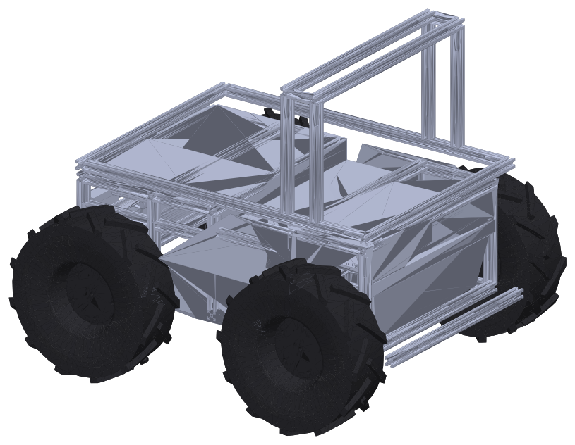
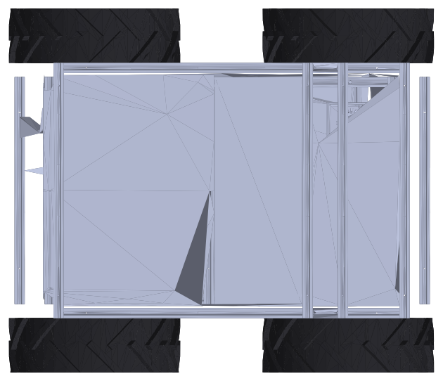

# Rover A1

Rover A1 is Mechatronics Academy's four-wheel-drive, skid-steer mobile platform for indoor and
outdoor robotics. This manual covers the **platform**: the chassis, drive train, power, safety
chain, IO and the ROS 2 software in the
[rover_ros](https://github.com/RaduPotlog/rover_ros) repository.

{ width="520" }

!!! danger "Before the first use"
    Read the [Safety](safety.md) chapter first. Know where the hardware emergency stop button is
    and how to reset the E-Stop latch before you drive the rover.

## Key features

-   :material-weight-kilogram: **59 kg**

    Mass with batteries (CAD), limit 60 kg

-   :material-speedometer: **0.95 m/s · 1.5 rad/s**

    Maximum linear and angular speed

-   :material-car-traction-control: **4 × DC motor, 4WD skid-steer**

    23.3 : 1 gearboxes, 1024-count encoders, 4 × Phidget DCC1000 controllers

-   :material-battery-high: **40 Ah LiFePO4**

    Daly BMS with live telemetry in ROS 2

-   :material-alert-octagon: **Hardware E-Stop chain**

    PLC latch, motor contactor and watchdog, plus software and RC E-Stops

-   :material-robot-outline: **ROS 2 + ros2_control**

    Closed-loop wheel speed control at 50 Hz, Gazebo simulation included

## Specification at a glance

| Parameter | Value |
|---|---|
| Dimensions (L × W × H) | 0.843 × 0.722 × 0.688 m (CAD) |
| Wheelbase / track | 0.503 m / 0.617 m |
| Wheels | 13 in, 0.1651 m effective rolling radius |
| Ground clearance | 0.113 m (CAD) |
| Payload | **TBD** |
| Runtime | **TBD** |
| Ingress protection | **TBD** |

The full tables are in [Specification](hardware/specification.md).

## What is in this manual

| Chapter | What it covers |
|---|---|
| [Specification](hardware/specification.md) | Dimensions, mass, traction, wheels, battery, sensors |
| [Components](hardware/components.md) | What is inside the rover, and the block diagram |
| [Power and battery](hardware/power-and-battery.md) | Battery, BMS telemetry, thresholds, shutdown |
| [IO and network](hardware/io-and-network.md) | User digital IO on the safety PLC, Modbus, platform network |
| [Safety](safety.md) | The E-Stop chain, how to trigger and reset it, LED status |
| [Software overview](software/overview.md) | Software architecture, packages, getting started |
| [ROS 2 API](software/ros-api.md) | Topics, services, parameters, launch files, TF tree |
| [Drive and control](software/drive-and-control.md) | Command arbitration, drive controller, wheel PID, calibration |
| [Teleop and LEDs](software/teleop-and-leds.md) | RC remote, Foxglove, LED panels |
| [Simulation](software/simulation.md) | Running the rover in Gazebo |
| [Open items](open-items.md) | Values not yet defined, and conflicts between sources |

## Scope

This manual describes the platform only. Navigation, missions, the fleet interface (VDA 5050)
and the payload sensors (lidar, GNSS, cameras) live in other repositories:
`rover_orchestrator`, `rover_vda5050` and `rover_sensors`.

## Gallery

Photos of the real rover are **TBD**. The images in this manual are rendered from the URDF
meshes (`rover_description/meshes/`) with `docs/tools/render_meshes.py`.

