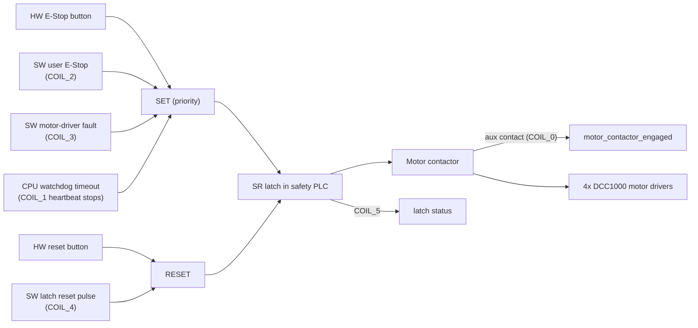
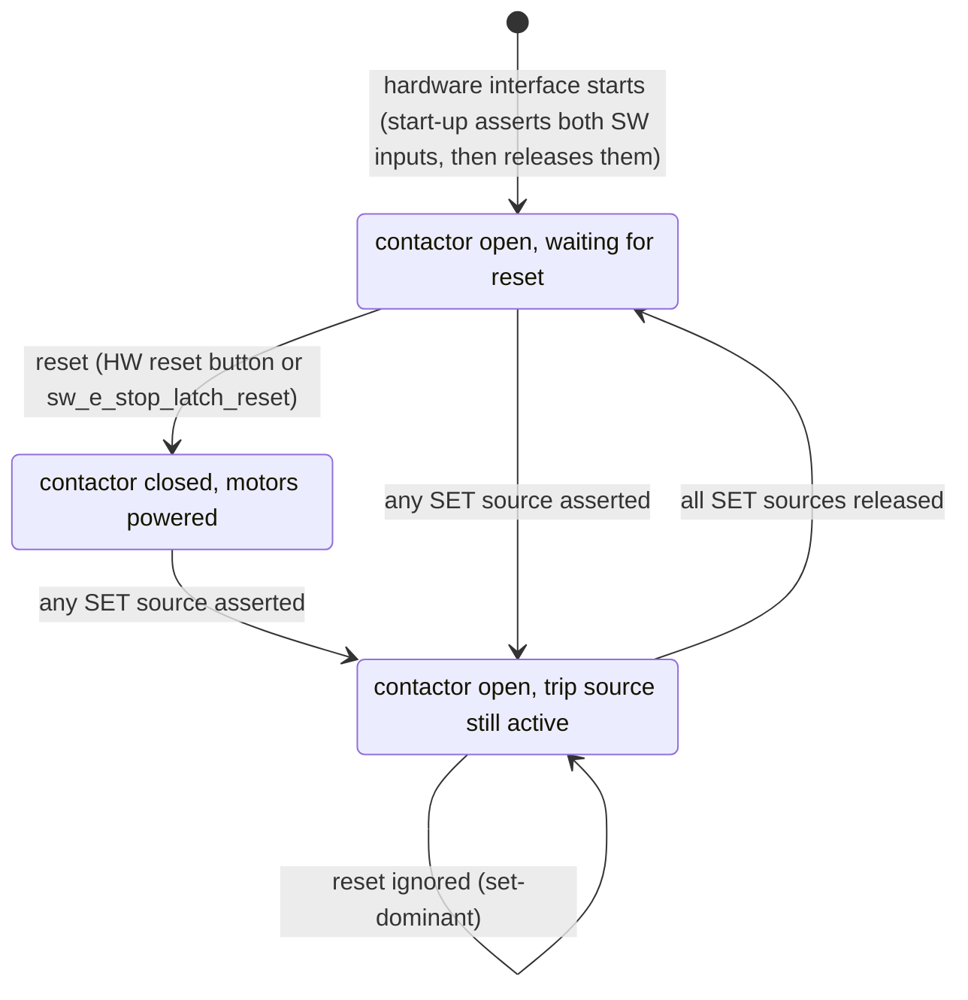

# Safety

This chapter covers how the Rover A1 stops, who and what can stop it, how to reset it, and what the LED panels tell you. Read it before you power the rover for the first time.

!!! danger "Before first use"
    - **Find the hardware E-Stop button and the hardware reset button before you drive.** Their positions on the chassis are **TBD** in this manual.
    - **The motor contactor is the only hardware stop.** Everything in software (motion lock, zero commands, lidar guards) is defense in depth behind it.
    - **The rover starts E-stopped.** Every start of the hardware interface leaves the safety latch set. You must reset the latch before the rover moves (see [Reset after start-up](#reset-after-start-up)).
    - **The RC transmitter has the highest command priority.** The person with line of sight holding the transmitter has the last word. The RC transmitter, the Foxglove joystick and MANUAL mode bypass the lidar obstacle guards by design.
    - **The front and rear LEDs show the `E_STOP` animation only for the hardware button.** A software E-Stop or a held latch does *not* change the LEDs (see [LED status](#led-status)).
    - **The stop distance has not been measured.** It is **TBD**. The motor driver's on-board ramp (`motor_acceleration`) also applies when slowing down, so it makes every stop longer, E-Stop included.
    - **Lift the wheels off the ground for first tests and tuning runs.** The calibration tools only move the rover when you pass `-p enable_motion:=true`.

ROS names on this page are relative to the robot namespace `rover`. For example, `hardware_interface/sw_user_e_stop_set` is `/rover/hardware_interface/sw_user_e_stop_set`.

## The E-Stop chain

Four sources can trip the safety relay (SET). Two can release it (RESET). The relay is a set-dominant latch inside the safety PLC. Its output drives the coil of the motor contactor. An auxiliary contact on the contactor reports back to the PLC whether the contacts are really closed.



Two properties matter:

- **Set-dominant.** A reset has no effect while any trip source is still asserted. The trip wins.
- **Latching.** The stop holds after the trip source clears. Only a deliberate reset releases it. A momentary fault cannot clear itself.

Source: `rover_arch/SAFETY_CHAIN.md` §1.

### Latch states



On start-up the safety controller writes the default state of each writable coil. The two software E-Stop inputs default to asserted. The hardware interface then releases them during configure, but the latch they set stays set until a reset.

Source: `rover_hardware_interface/src/rover_safety_controller/rover_safety_controller.cpp` (coil table, `initCoils()`), `rover_hardware_interface/include/rover_hardware_interface/domain/emergency_stop.hpp` (`releaseStartupTriggers()`).

### Safety PLC signals

The hardware interface talks to the safety PLC over Modbus TCP at `192.168.88.11:502`. For the link details see [IO and network](hardware/io-and-network.md).

| Signal | Modbus object | Direction | Meaning |
|---|---|---|---|
| `hw_e_stop_user_button` | `CONTACT_0` | PLC to ROS | Hardware E-Stop button pressed |
| `motor_contactor_engaged` | `COIL_0` | PLC to ROS | Contactor aux contact: contacts closed |
| `cpu_wdg_heartbeat` | `COIL_1` | ROS to PLC | Watchdog heartbeat (toggled) |
| `sw_e_stop_user_button` | `COIL_2` | ROS to PLC | Software user E-Stop (SET input) |
| `sw_e_stop_motor_driver_fault` | `COIL_3` | ROS to PLC | Software motor-driver fault (SET input) |
| `sw_e_stop_latch_reset` | `COIL_4` | ROS to PLC (pulse) | Latch reset |
| `sw_e_stop_latch_status` | `COIL_5` | PLC to ROS | Latch active |

Source: `rover_arch/SAFETY_CHAIN.md` §2, `rover_description/urdf/rover_a1/rover_a1_macro.urdf.xacro` (`modbus_host`, `modbus_port`).

!!! note
    In the current code the software motor-driver fault input (`COIL_3`) is asserted only during start-up. No runtime path asserts it. Motor-driver faults are handled in software instead (see [Motion gates](#motion-gates)).

### Watchdog heartbeat

The hardware interface toggles `COIL_1` on its own thread. If the toggling stops for longer than the relay's watchdog window, the relay trips and latches. This covers a crashed or hung computer.

| Parameter | Value | Note |
|---|---|---|
| `safety_wdg_kick_period_ms` | 200 ms | Heartbeat toggle period (5 Hz) |
| Relay watchdog window | ~1 s | Measured on the A1, a hardware property |
| `modbus_response_timeout_ms` | 150 ms | Bounds how long one slow transaction can delay a heartbeat |
| `safety_io_poll_period_ms` | 100 ms | IO poll (10 Hz), separate thread |

Source: `rover_description/urdf/rover_a1/rover_a1_macro.urdf.xacro`, `rover_arch/SAFETY_CHAIN.md` §3.

!!! warning
    Do not raise `safety_wdg_kick_period_ms` without re-measuring the relay's watchdog window. 200 ms gives about 5x margin against the ~1 s window.

### Software E-Stops

The hardware interface node `rover_hardware_controller` offers three `std_srvs/Trigger` services:

| Service | Effect | Refused when |
|---|---|---|
| `hardware_interface/sw_user_e_stop_set` | Asserts the SW user E-Stop (`COIL_2`), which trips the latch | Modbus write fails |
| `hardware_interface/sw_user_e_stop_reset` | Releases the SW user E-Stop | Hardware interface not ACTIVE; any wheel velocity command above `velocity_command_zero_tolerance` (0.4 rad/s); any measured wheel velocity above `velocity_state_zero_tolerance` (0.05 rad/s) |
| `hardware_interface/sw_e_stop_latch_reset` | Pulses `COIL_4` for `safety_latch_reset_pulse_ms` (100 ms). Also clears latched motor-failsafe and welded-contactor faults and re-arms the motor drivers' watchdog | Hardware interface not ACTIVE |

Source: `rover_hardware_interface/src/rover_system/rover_system.cpp` (`resetEStop()`, `resetEStopLatch()`, `areVelocityCommandsNearZero()`), `rover_description/urdf/rover_a1/rover_a1_macro.urdf.xacro`.

!!! warning "Source conflict"
    `rover_arch/SAFETY_CHAIN.md` §6 gives `velocity_command_zero_tolerance` as 0.35 rad/s. The URDF that the hardware interface reads sets 0.4 rad/s (`rover_description/urdf/rover_a1/rover_a1_macro.urdf.xacro`). This page uses 0.4 rad/s.

The state is published on two topics at 20 Hz (reliable, volatile, keep last 1):

| Topic | Type | Use |
|---|---|---|
| `hardware_interface/safety_status` | `rover_msgs/SafetyStatus` | Plant state: HW button, contactor, latch, `latch_cause`, `link_healthy`. May permit or inhibit motion. |
| `hardware_interface/safety_command_echo` | `rover_msgs/SafetyCommandEcho` | Read-backs of the coils ROS drives. May only ever inhibit motion. |

Source: `rover_arch/SAFETY_CHAIN.md` §4, `rover_msgs/msg/SafetyStatus.msg`, `rover_msgs/msg/SafetyCommandEcho.msg`, `driver_states_update_frequency` in `rover_description/urdf/rover_a1/rover_a1_macro.urdf.xacro`.

### RC switches and RC link failsafe

The ELRS RC teleop node (`rover_crsf_teleop_node`) calls the same services from two transmitter switches. Only a change of switch position fires a call.

| Channel | Switch position | Action |
|---|---|---|
| 5 (`e_stop_channel`) | low | `sw_user_e_stop_set` |
| 5 | high | `sw_user_e_stop_reset` |
| 4 (`e_stop_latch_reset_channel`) | low | `sw_e_stop_latch_reset` |

"Low" means a raw channel value below `channel_switch_threshold` (500). At start-up the node spends `switch_settle_frames` (100 ticks of 20 ms, 2 s) learning the switches' resting positions and fires nothing. Switches are ignored while the RC link is lost.

**RC link failsafe.** The link counts as lost when no frame arrives within `channel_timeout_ms` (200 ms), when link statistics are older than `link_stats_timeout_ms` (1000 ms), or when uplink link quality drops below `link_quality_lost_below` (30 %, recovers at 50 %). The node then publishes zeros for `zero_burst_duration_ms` (300 ms) and goes silent. The rover stops and `twist_mux` falls through to its next input. **A lost RC link does not trip the E-Stop.**

Source: `rover_crsf_teleop/config/rover_crsf_teleop.yaml`, `rover_crsf_teleop/README.md`. More in [Teleop and LEDs](software/teleop-and-leds.md).

### Battery-driven E-Stop and shutdown

`rover_safety_node` (package `rover_safety`) watches `rover_battery/battery_status` and acts through a behavior tree at 10 Hz:

| Battery reading | Action |
|---|---|
| health `WATCHDOG_TIMER_EXPIRE`, `DEAD` or `OVERVOLTAGE` | Calls `hardware_interface/sw_user_e_stop_set` |
| health `OVERHEAT` and temperature above `battery.temp.critical` (50 °C) | Calls `hardware_interface/sw_user_e_stop_set` |
| health `OVERHEAT` and temperature above `battery.temp.fatal` (60 °C) | Shuts down the ROS controller computer |
| anything else | Nothing |

The shutdown sequence trips the E-Stop, asks the hosts in `config/shutdown_hosts.yaml` to power off (the shipped file lists none), then runs `shutdown_ros_controller.sh`. You can also start it by hand:

```bash
ros2 service call /rover/rover_safety_node/shutdown std_srvs/srv/Trigger {}
```

`rover_safety_node` is not started in simulation (`use_sim:=True`).

Source: `rover_safety/include/rover_safety/domain/battery_safety_policy.hpp`, `rover_safety/src/domain/battery_safety_policy.cpp`, `rover_safety/behavior_trees/rover_safety.xml`, `rover_safety/config/rover_safety.yaml`, `rover_safety/README.md`.

## Motion gates

Five independent gates stand between a velocity command and a turning wheel, from the wire inwards:

| # | Gate | Where | Behaviour |
|---|---|---|---|
| 1 | Motor contactor | Hardware | Cuts motor power when the latch is set. |
| 2 | Motion lock | `rover_twist_mux` / `rover_motion_lock_node` | Publishes `motion_lock` (`std_msgs/Bool`) at 10 Hz. `twist_mux` lock priority 200 masks every input. Locked before the first message, when either safety topic is older than `gpio_timeout` (1.0 s), when `link_healthy` is false, or when any enabled stop condition is active. A stale lock (0.5 s) also counts as locked. |
| 3 | Hardware interface `write()` | `rover_hardware_interface` | On any E-Stop or latched hardware fault it sends **zeros** to the motor drivers rather than going silent, so the drivers' own failsafe (`motor_failsafe_timeout_ms`, 500 ms) keeps being fed. |
| 4 | Contactor plausibility check | `ContactorMonitor` | Latch active and contactor still engaged for more than 500 ms is a latched, fatal "welded contactor" fault. Cleared only by `sw_e_stop_latch_reset`. |
| 5 | `IsMotionLocked` BT condition | Navigation stack (another repo) | Aborts a navigation tree rather than driving into a closed mux. |

Stop conditions enabled in the motion lock: HW E-Stop button, SW user E-Stop, SW motor-driver fault, latch status. `require_motor_contactor_engaged` is off (unverified on hardware).

Source: `rover_arch/SAFETY_CHAIN.md` §5, `rover_twist_mux/config/rover_motion_lock.yaml`, `rover_twist_mux/config/rover_twist_mux.yaml`, `rover_hardware_interface/include/rover_hardware_interface/domain/contactor_monitor.hpp` (`kDefaultContactorDropOutToleranceMs`), `rover_description/urdf/rover_a1/rover_a1_macro.urdf.xacro`.

!!! note
    With no hardware interface running there is no safety state, so the motion lock stays closed and the rover accepts no velocity commands. This is intended.

The driving modes (MANUAL, ASSISTED, AUTOMATIC) and the lidar collision monitors live in `rover_orchestrator`, not in this repository. They are not safety functions.

## Timing budget

| Stage | Value | Source |
|---|---|---|
| `controller_manager`, `read()` / `write()` | 50 Hz | `rover_controller/config/wheel_01_controller.yaml` |
| `safety_status` / `safety_command_echo` publish | 20 Hz | `driver_states_update_frequency`, URDF |
| Modbus IO poll | 100 ms (10 Hz) | `safety_io_poll_period_ms`, URDF |
| Watchdog heartbeat toggle | 200 ms (5 Hz) | `safety_wdg_kick_period_ms`, URDF |
| Modbus response timeout | 150 ms | `modbus_response_timeout_ms`, URDF |
| Relay watchdog window | ~1 s (measured) | `rover_arch/SAFETY_CHAIN.md` §3 |
| Latch reset pulse | 100 ms | `safety_latch_reset_pulse_ms`, URDF |
| Motion lock publish / staleness / mux lock timeout | 10 Hz / 1.0 s / 0.5 s | `rover_twist_mux/config/` |
| `twist_mux` input timeouts | 0.3 s (Driver UI), 0.5 s (others) | `rover_twist_mux/config/rover_twist_mux.yaml` |
| `diff_drive` `cmd_vel_timeout` | 0.5 s | `rover_controller/config/wheel_01_controller.yaml` |
| Motor driver hardware watchdog | 500 ms | `motor_failsafe_timeout_ms`, URDF |
| Contactor drop-out tolerance | 500 ms | `contactor_monitor.hpp` |
| RC frame timeout / zero burst | 200 ms / 300 ms | `rover_crsf_teleop/config/rover_crsf_teleop.yaml` |

"URDF" is `rover_description/urdf/rover_a1/rover_a1_macro.urdf.xacro`.

## Trigger an E-Stop

Use any of these. The first is the only one that does not depend on software.

1. Press the hardware E-Stop button.
2. Move the RC transmitter's channel 5 switch to low.
3. Press the SW E-Stop button in the Foxglove layout or the Driver UI.
4. Call the service:

    ```bash
    ros2 service call /rover/hardware_interface/sw_user_e_stop_set std_srvs/srv/Trigger
    ```

Check the result:

```bash
ros2 topic echo /rover/hardware_interface/safety_status --once
```

`latch_active` should read `true` and `motor_contactor_engaged` should read `false`.

## Reset an E-Stop

The latch is set-dominant. Clear every trip source first, then reset the latch.

### Reset after a hardware button stop

1. Make sure the area around the rover is clear and nothing commands motion (sticks centred, joystick released).
2. Release the hardware E-Stop button.
3. Reset the latch: press the hardware reset button, **or** move RC channel 4 to low, **or** call:

    ```bash
    ros2 service call /rover/hardware_interface/sw_e_stop_latch_reset std_srvs/srv/Trigger
    ```

4. Check that `latch_active` is `false` and `motor_contactor_engaged` is `true` on `hardware_interface/safety_status`, and that `motion_lock` is `false`.

### Reset after a software E-Stop

1. Wait until the rover has stopped. Centre the sticks and release every joystick.
2. Release the SW user E-Stop: RC channel 5 to high, **or** call:

    ```bash
    ros2 service call /rover/hardware_interface/sw_user_e_stop_reset std_srvs/srv/Trigger
    ```

3. Reset the latch as in step 3 above.
4. Check the topics as in step 4 above.

### Reset after start-up

The latch is set after every start of the hardware interface. Wait until the hardware interface is ACTIVE, then reset the latch as above. The latch reset services refuse while the hardware interface is not ACTIVE.

### When a reset is refused

| Message or symptom | Cause | Fix |
|---|---|---|
| `E-Stop reset refused: the wheels are still turning` | A measured wheel speed is above 0.05 rad/s | Wait for the rover to stop. |
| `E-Stop reset refused: largest` ... `velocity command` ... | A wheel command is above 0.4 rad/s | Stop the source publishing `cmd_vel`. For RC teleop, the stick deadband must cover the sticks' resting offset (calibrate the transmitter). |
| `... not in ACTIVE state` | Hardware interface not active | Check `ros2 control list_hardware_components`. |
| Service succeeds but the latch stays set | A trip source is still asserted (set-dominant) | Release the HW button and the SW user E-Stop first. |

Source: `rover_hardware_interface/src/rover_system/rover_system.cpp`.

## LED status

`rover_led_safety_node` (package `rover_safety`) picks the LED animations from the battery state and the hardware E-Stop button, and requests them from `rover_led`. Each bumper has four layers; a higher layer covers the ones below where its pixels are not transparent. Layer order from top: `ERROR` (0), `ALERT` (1), `INFO` (2), `STATE` (3).

!!! warning
    The `E_STOP` animation follows only `hw_e_stop_user_button`. A software E-Stop, an RC E-Stop, a watchdog trip or a held latch leaves the LEDs on `READY`. Check `hardware_interface/safety_status` or the Foxglove indicators to know whether the latch is set.

Each image below is a timeline: the top row is the first frame and each column is one LED across the bumper. `rover_led` stretches the image to the panel width and the animation duration. Front images are white and rear images are red; they are shown on a dark background.

| Animation (id) | Layer | Shown when | Front | Rear |
|---|---|---|---|---|
| `E_STOP` (0) | STATE | Hardware E-Stop button pressed | { width="46" height="175" style="background:#222" } | { width="46" height="175" style="background:#222" } |
| `READY` (1) | STATE | Button not pressed, no dead-man button held | { width="46" height="175" style="background:#222" } | { width="46" height="175" style="background:#222" } |
| `MANUAL_ACTION` (4) | STATE | Dead-man button on `joy` held (see note) | { width="46" height="175" style="background:#222" } | { width="46" height="175" style="background:#222" } |
| `ERROR` (2) | ERROR | Battery status `UNKNOWN`, or charging while `OVERHEAT`. Flashes over everything. | { width="46" height="175" style="background:#222" } | same image |
| `CHARGER_INSERTED` (9) | ALERT | Charger connected (after 0.3 s) | { width="46" height="175" style="background:#222" } | { width="46" height="175" style="background:#222" } |
| `CHARGING_BATTERY` (7) | INFO | Charging (after 2.5 s), bar shows the level | { width="50" height="175" style="background:#222" } | { width="50" height="175" style="background:#222" } |
| `BATTERY_CHARGED` (8) | INFO | Charging and the rounded level reads 100 % | { width="50" height="175" style="background:#222" } | { width="50" height="175" style="background:#222" } |
| `LOW_BATTERY` (5) | INFO | Discharging, level from 10 % to below 40 %; repeated every 30 s | { width="50" height="175" style="background:#222" } | same image, mirrored |
| `CRITICAL_BATTERY` (6) | INFO | Discharging, level below 10 % | { width="50" height="175" style="background:#222" } | same image, mirrored |
| `BATTERY_NOMINAL` (10) | INFO | Discharging, level 40 % or more (blank) | (empty) | (empty) |
| `NO_ERROR` (3) | ERROR | No battery error (blank) | (empty) | (empty) |

Thresholds: `battery.percent.threshold.critical` 0.1, `battery.percent.threshold.low` 0.4, `battery.anim_period.low` 30 s.

Source: `rover_safety/include/rover_safety/domain/led_animation_policy.hpp`, `rover_safety/behavior_trees/rover_led_safety.xml`, `rover_safety/config/led_safety.yaml`, `rover_led/config/rover_a1_animations.yaml`, images from `rover_led/animations/rover_a1/`.

!!! note
    Nothing in this repository publishes `joy`, so `MANUAL_ACTION` is not shown unless a joystick driver is added. Driving with the RC transmitter shows `READY`.

The full animation catalog and the LED services are in [Teleop and LEDs](software/teleop-and-leds.md#led-panels).

## Known gaps

From `rover_arch/SAFETY_CHAIN.md` §6, plus what the code shows:

- **The PLC cannot say why it tripped.** `SafetyStatus.latch_cause` exists but reads `LATCH_CAUSE_UNKNOWN` until the PLC program latches the cause into readable coils.
- **The command-side reset deadband is still wide.** `velocity_command_zero_tolerance` is 0.4 rad/s. It was set that way because the wheel PIDs' frozen integral (then `i_clamp_max` 0.25 / 0.33) kept the command above zero while motion was inhibited. The wheel PIDs now run with `stop_at_zero_reference`, which sends exactly 0 and clears the integral at a zero reference, so that reason no longer holds. The tolerance has not been lowered yet. The measured-velocity check (0.05 rad/s) closes the actual hazard in the meantime.
- **Don't turn off `stop_at_zero_reference` on the real rover.** Without it, the frozen integral can hold the command at up to `i_clamp_max` (now 2.0 rad/s) while motion is inhibited. That is above the 0.4 rad/s tolerance, so the E-Stop could not be reset, and the DCC1000 would not brake.
- **No end-to-end test** that an asserted `motion_lock` stops `cmd_vel` at the mux.
- **The lidar guards are obstacle avoidance, not protection.** One 2D scan slice misses low and overhanging obstacles. MANUAL, RC and Foxglove bypass them. No measured stop distance yet.
- **`ros2_control`'s GPIO mechanism is not used** for the safety IO (deliberate).
- **`read()` / `write()` always return `OK`.** A dead safety link reaches diagnostics and the topics, but `controller_manager` cannot deactivate on it.
- **LEDs do not show a software E-Stop or a held latch** (see [LED status](#led-status)).
- **The software motor-driver fault input is not asserted at runtime** (see the note in [Safety PLC signals](#safety-plc-signals)).

Full text: [SAFETY_CHAIN.md](https://github.com/RaduPotlog/rover_ros/blob/master/rover_arch/SAFETY_CHAIN.md).

## Transport and handling

Lifting points, towing, free-wheeling with power off, shipping, storage and battery handling are **TBD**. Until they are documented, power the rover down and press the hardware E-Stop before you lift or move it by hand.

## Further reading

- [rover_safety README](https://github.com/RaduPotlog/rover_ros/blob/master/rover_safety/README.md)
- [rover_twist_mux README](https://github.com/RaduPotlog/rover_ros/blob/master/rover_twist_mux/README.md)
- [rover_hardware_interface README](https://github.com/RaduPotlog/rover_ros/blob/master/rover_hardware_interface/README.md)
- [rover_crsf_teleop README](https://github.com/RaduPotlog/rover_ros/blob/master/rover_crsf_teleop/README.md)
