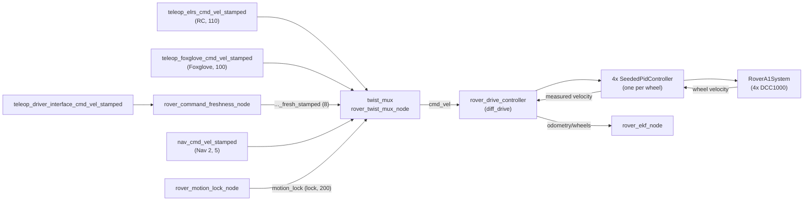

# Drive and control

This page describes how a velocity command becomes wheel motion on the Rover A1: command arbitration, the safety gates in the path, the `ros2_control` controller chain and the hardware interface. It also covers the drive limits, odometry and the calibration tools.

ROS names on this page are relative to the robot namespace `rover`. For example, `cmd_vel` is `/rover/cmd_vel`.

## Drive topology



1. **`twist_mux`** (`rover_twist_mux_node`) is the only publisher of `cmd_vel`. The highest-priority fresh input wins.
2. **`rover_motion_lock_node`** closes the mux on any E-Stop or stale safety state. **`rover_command_freshness_node`** drops Driver UI commands that arrive late.
3. **`rover_drive_controller`** (`diff_drive_controller/DiffDriveController`) turns `cmd_vel` into left and right wheel speeds and publishes wheel odometry.
4. **Four `rover_controller/SeededPidController`s** close the speed loop on each wheel's encoder velocity.
5. **`rover_hardware_interface/RoverA1System`** sends the velocity commands to four Phidget DCC1000 motor controllers and owns the safety PLC link.

Source: `rover_twist_mux/config/rover_twist_mux.yaml`, `rover_twist_mux/launch/rover_twist_mux.launch.py`, `rover_controller/config/wheel_01_controller.yaml`, `rover_hardware_interface/README.md`.

## Command arbitration (twist_mux)

All inputs are `geometry_msgs/TwistStamped` (`use_stamped: true`). The launch file remaps the mux output `cmd_vel_out` to `cmd_vel`.

| Input | Topic | Priority | Timeout | Source |
|---|---|---:|---:|---|
| `cmd_elrs` | `teleop_elrs_cmd_vel_stamped` | 110 | 0.5 s | ELRS RC teleop (`rover_crsf_teleop`) |
| `joystick` | `teleop_foxglove_cmd_vel_stamped` | 100 | 0.5 s | Foxglove virtual joystick, calibration tools |
| `driver_interface` | `teleop_driver_interface_cmd_vel_fresh_stamped` | 8 | 0.3 s | Driver UI, via `rover_command_freshness_node` |
| `nav` | `nav_cmd_vel_stamped` | 5 | 0.5 s | Nav 2 (orchestrator computer) |

| Lock | Topic | Priority | Timeout | Source |
|---|---|---:|---:|---|
| `motion_lock` | `motion_lock` (`std_msgs/Bool`) | 200 | 0.5 s | `rover_motion_lock_node` |

An input is masked when its priority is below the lock's, so at 200 an active lock stops every source. A stale lock counts as locked. The RC transmitter has the highest input priority, so the operator with line of sight always has the last word. Nav 2 has the lowest, so any teleop source pre-empts autonomy.

The Driver UI, the drive modes and Nav 2 live in other repositories (`rover_drive_interface`, `rover_orchestrator`).

Source: `rover_twist_mux/config/rover_twist_mux.yaml`, `rover_twist_mux/README.md`.

### Motion lock

`rover_motion_lock_node` subscribes to `hardware_interface/safety_status` and `hardware_interface/safety_command_echo` and publishes `motion_lock` at 10 Hz. It is fail-safe closed: the lock is asserted before both topics have arrived, when either is older than `gpio_timeout` (1.0 s), when `link_healthy` is false, or when an enabled stop condition is active.

| Parameter | Value | Meaning |
|---|---|---|
| `publish_frequency` | 10.0 Hz | Republish rate |
| `gpio_timeout` | 1.0 s | Safety topic staleness limit |
| `use_hw_e_stop_user_button` | `true` | Hardware E-Stop button locks |
| `use_sw_e_stop_user_button` | `true` | SW user E-Stop locks |
| `use_sw_e_stop_motor_driver_fault` | `true` | SW motor-driver fault locks |
| `use_sw_e_stop_latch_status` | `true` | Latched relay locks |
| `require_motor_contactor_engaged` | `false` | Contactor open locks (unverified on hardware, off) |

Source: `rover_twist_mux/config/rover_motion_lock.yaml`. See [Safety](../safety.md#motion-gates) for the full gate list.

### Command freshness

The Driver UI's commands cross a websocket, which can hold them during a Wi-Fi stall and deliver them in a burst. `rover_command_freshness_node` tracks the best recent delivery delay (the baseline) and drops any command more than `max_delay` beyond it. Unstamped commands are dropped.

| Parameter | Value |
|---|---|
| `input_topic` | `teleop_driver_interface_cmd_vel_stamped` |
| `output_topic` | `teleop_driver_interface_cmd_vel_fresh_stamped` |
| `max_delay` | 0.3 s |
| `max_clock_drift` | 0.001 s/s |
| `resync_gap` / `resync_time` | 1.0 s / 2.0 s |

It reports a `Command freshness` diagnostic, WARN while it is dropping commands.

Source: `rover_twist_mux/config/rover_command_freshness.yaml`, `rover_twist_mux/README.md`.

## Kinematic limits

`rover_drive_controller` limits linear and angular velocity independently.

| Limit | Value |
|---|---|
| Linear velocity `linear.x` | ±0.95 m/s |
| Linear acceleration / deceleration | 2.7 m/s² |
| Angular velocity `angular.z` | ±1.5 rad/s |
| Angular acceleration / deceleration | 3.74 rad/s² |
| Jerk limits | none (`.NAN`) |
| `cmd_vel_timeout` | 0.5 s |
| Wheel joint velocity limit (URDF) | 10.958 rad/s |
| Hardware full-duty wheel speed (PID `u_clamp`) | 12.58 rad/s |

Source: `rover_controller/config/wheel_01_controller.yaml`, `rover_description/urdf/common/wheel.urdf.xacro`.

Because the two axes are limited separately, the outer wheel's rim speed can reach v + ω × (effective track) / 2. The config comment gives 0.95 + 1.5 × 0.5102 = 1.715 m/s (10.39 rad/s at r = 0.1651 m), under the URDF joint limit. RC teleop additionally scales stick commands so the outer rim stays under `max_wheel_rim_speed` (1.7 m/s).

!!! warning "Source conflict"
    The effective track width is `wheel_separation` × `wheel_separation_multiplier` = 0.617 × 1.659 = 1.0236 m from `rover_controller/config/wheel_01_controller.yaml`. The comment in the same file says the product is 1.020 m (it assumes a separation of 0.615 m), and `rover_crsf_teleop/config/rover_crsf_teleop.yaml` uses `effective_track_width: 1.0204` (0.62602 × 1.63). The controller uses 0.617 × 1.659.

## Rates

| Component | Rate | Note |
|---|---|---|
| `controller_manager` | 50 Hz | `read()` / `write()` cycle |
| Wheel PIDs, `rover_drive_controller` | 50 Hz | Odometry published every update |
| `rover_imu_broadcaster` | 50 Hz | Matches the EKF |
| `rover_joint_state_broadcaster` | 25 Hz | Nearest divisor of 50 to the 20 Hz encoders |
| Motor driver state, safety topics | 20 Hz | `driver_states_update_frequency` |
| Encoder updates (DCC1000) | 20 Hz (every 50 ms at most) | |
| EKF (`rover_ekf_node`) | 50 Hz | |

Every controller rate must divide the manager's 50 Hz (`rover_controller/test/test_wheel_geometry.py`).

Source: `rover_controller/config/wheel_01_controller.yaml`, `rover_controller/README.md`, `rover_description/urdf/rover_a1/rover_a1_macro.urdf.xacro`, `rover_localization/config/rel_localization.yaml`.

## Wheel geometry and the separation multiplier

| Parameter | Value |
|---|---|
| `wheels_per_side` | 2 |
| `wheel_separation` | 0.617 m |
| `wheel_radius` (odometry rolling radius) | 0.1651 m |
| `wheel_separation_multiplier` | 1.659 |
| `left_wheel_radius_multiplier` / `right_wheel_radius_multiplier` | 1.0 / 1.0 |

Source: `rover_controller/config/wheel_01_controller.yaml`, `rover_description/config/wheel_01.yaml` (must match, enforced by `test/test_wheel_geometry.py`).

**Why the multiplier exists.** The Rover A1 is a four-wheel skid-steer platform. When it turns, the wheels slip sideways, so the body turns more slowly than an ideal two-wheel differential drive with the same track would. `diff_drive_controller` models the ideal case. `wheel_separation_multiplier` scales the track to an effective value so the wheel speeds commanded for a turn, and the yaw rate the odometry reports, match the real rotation. The value depends on the surface. Measure it with `wheel_odom_calibration` (below) on the surface the rover mostly drives on.

## Odometry

`rover_drive_controller` publishes wheel odometry on `odometry/wheels` (frame `odom` to `base_footprint`) and **does not publish TF** (`enable_odom_tf: false`). The EKF in `rover_localization` (`rover_ekf_node`, `robot_localization`) fuses the wheel body velocities (vx, vy) with the IMU yaw rate, publishes the `odom` → `base_footprint` transform and the filtered odometry on `odom`.

| Item | Value |
|---|---|
| Wheel odometry topic | `odometry/wheels` |
| Wheel odometry TF | off |
| EKF output topic | `odom` (remapped from `odometry/filtered`) |
| EKF TF | `odom` → `base_footprint` (`publish_tf: true`) |
| EKF inputs | `odometry/wheels` (vx, vy), `imu/data` (yaw rate) |

Source: `rover_controller/config/wheel_01_controller.yaml`, `rover_localization/config/rel_localization.yaml`, `rover_localization/launch/rover_localization.launch.py`.

## Hardware interface

`RoverA1System` (`hardware_interface::SystemInterface`) exports a `velocity` command and `position`, `velocity` and `effort` states per wheel joint. Key URDF parameters for the drive:

| Parameter | Value | Meaning |
|---|---|---|
| `motor_acceleration` | 1.0 duty/s | DCC1000 on-board ramp. Also lengthens every stop. |
| `motor_current_limit` | 15.0 A | Per motor |
| `motor_supply_voltage` | 24.0 V | Used for the current regulator gain |
| `max_rpm_motor_speed` | 2800 rpm | |
| `gear_ratio` | 23.3 | |
| `encoder_resolution` | 1024 | |
| `motor_failsafe_timeout_ms` | 500 ms | DCC1000 hardware watchdog. Brakes the motor if commands stop. |
| `driver_comm_timeout_ms` | 300 ms | Telemetry age that counts as a communication error |

On any E-Stop or latched fault, `write()` keeps sending **zero** commands so the DCC1000 watchdog stays fed. A tripped motor watchdog is latched and is cleared only by `hardware_interface/sw_e_stop_latch_reset`.

Source: `rover_description/urdf/rover_a1/rover_a1_macro.urdf.xacro`, `rover_hardware_interface/README.md`.

!!! note "URDF comment conflict"
    The URDF comment for `motor_current_limit` describes 10 A, but the value set is 15.0 A. The hardware interface uses 15.0 A.

## Wheel PID controller

Each wheel has a `rover_controller/SeededPidController`. It is the stock `pid_controller/PidController` with one change: on activation it seeds its exported state from the hardware, so the chained `diff_drive` never reads NaN on its first cycle. Without it, `controller_manager` deactivated the whole chain on every activation on the real rover.

| Gain | fl, fr | rl, rr |
|---|---|---|
| `p` | 0.05 | 0.05 |
| `i` | 1.0 | 1.0 |
| `d` | 0.04 | 0.04 |
| `feedforward_gain` | 1.0 | 1.0 |
| `i_clamp_min` / `i_clamp_max` | ±0.25 | ±0.33 |
| `u_clamp_min` / `u_clamp_max` | ±12.58 | ±12.58 |
| `antiwindup_strategy` | `back_calculation` | `back_calculation` |
| `save_i_term` | `false` | `false` |

The feedforward carries most of the command, and the PID trims load, battery and slip error. With `p = i = d = 0` the drive is open loop, which is the quickest A/B comparison. `i_clamp` is what bounds overshoot. Each PID publishes `<pid>/controller_state`.

Measured with these gains (wheels lifted, median of 4 wheels): overshoot ≤ 9.6 % and steady-state error ≤ 2.3 %. On-ground tuning is still open.

Source: `rover_controller/config/wheel_01_controller.yaml`, `rover_controller/include/rover_controller/seeded_pid_controller.hpp`, `rover_controller/docs/wheel_pid_tuning_notes.md`.

Details: [rover_controller README](https://github.com/RaduPotlog/rover_ros/blob/master/rover_controller/README.md) and [wheel PID tuning notes](https://github.com/RaduPotlog/rover_ros/blob/master/rover_controller/docs/wheel_pid_tuning_notes.md). Read the tuning notes before changing a gain.

## Calibration tools

Both tools publish on the Foxglove input `teleop_foxglove_cmd_vel_stamped` (priority 100), so the motion lock still gates them. They print their plan and only move the rover with `-p enable_motion:=true`. Results go to `~/rover_calibration/<tool>_<timestamp>/` (`summary.yaml` and raw samples).

!!! danger
    These tools drive the rover. Lift the wheels for the first run, keep the area clear, and keep the hardware E-Stop in reach.

Run them in this order:

1. **Wheel-speed loop** (`wheel_step_response`). Steps the linear speed (default 0.2, 0.4, 0.6, 0.8, −0.4 m/s) and the angular speed (0.5, 1.0, −1.0 rad/s), and reports overshoot, steady-state error and dead time per wheel. It also reports body acceleration limits derived from the largest wheel acceleration (`margin` 0.8). Target: overshoot under 10 % and steady-state error under 3 %. Run with the wheels lifted first, then on the ground.

    ```bash
    ros2 run rover_controller wheel_step_response --ros-args -r __ns:=/rover -p enable_motion:=true
    ```

2. **Acceleration limits.** Use the limits reported in step 1 to set `linear.x` / `angular.z` acceleration in `wheel_01_controller.yaml`.

3. **Skid-steer calibration** (`wheel_odom_calibration`). `mode:=spin` spins in place at several rates (default ±0.3, ±0.6, ±1.0 rad/s), compares the rotation the wheel speeds explain with the IMU gyro and reports `wheel_separation_multiplier`. `mode:=straight` drives until wheel odometry reads `distance`; tape-measure the real distance `d` and set both wheel radius multipliers to `d / distance`.

    ```bash
    ros2 run rover_controller wheel_odom_calibration --ros-args -r __ns:=/rover -p mode:=spin -p enable_motion:=true
    ros2 run rover_controller wheel_odom_calibration --ros-args -r __ns:=/rover -p mode:=straight -p distance:=5.0 -p enable_motion:=true
    ```

!!! warning "Source conflict"
    The tools' built-in geometry defaults do not match the controller config. `wheel_step_response` declares `wheel_separation` 0.62602 and `wheel_separation_multiplier` 1.5. `wheel_odom_calibration` declares `wheel_separation` 0.62602. `rover_controller/config/wheel_01_controller.yaml` uses 0.617 and 1.659. Pass the current values as parameters (for example `-p wheel_separation:=0.617`) when you run the tools.

Source: `rover_controller/README.md`, `rover_controller/rover_controller/wheel_step_response.py`, `rover_controller/rover_controller/wheel_odom_calibration.py`, `rover_controller/rover_controller/drive_session.py`.

## Further reading

- [rover_twist_mux README](https://github.com/RaduPotlog/rover_ros/blob/master/rover_twist_mux/README.md)
- [rover_hardware_interface README](https://github.com/RaduPotlog/rover_ros/blob/master/rover_hardware_interface/README.md)
- [rover_localization README](https://github.com/RaduPotlog/rover_ros/blob/master/rover_localization/README.md)
