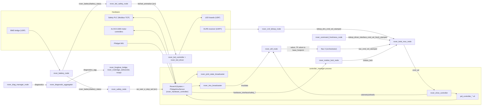

# Software overview

The Rover A1 platform software is the `rover_ros` repository: a ROS 2 workspace that drives the
wheels, reads the IMU and the safety PLC, arbitrates velocity commands, fuses odometry and runs
the battery, LED, teleop and diagnostics nodes. This page shows how it is deployed, what each
package does, and how to build and start it.

## Runtime environment

| Item | Value |
|------|-------|
| ROS 2 distribution | `lyrical` |
| Middleware (RMW) | `rmw_zenoh_cpp`, ROS domain `0` |
| Zenoh router | Runs in its own container, `rover-a1-zenoh-router`, on TCP port `7447` |
| Platform container | `rover-a1-platform`. Its image is built from `rover_docker/rovera1_app` (separate repository) |
| Device management | balenaCloud. Device variables such as `ROVER_USE_GPS` reach the launch files as environment variables; the container's `start.sh` normalizes them |
| Rover LAN address | `192.168.1.201` (default target of the PC setup script) |
| Robot namespace | `rover` (`ROVER_NAMESPACE`) |
| Controller computer (CPU, OS) | **TBD** |

Source: `README.md`, `rover_scripts/setup_rover_pc.sh`, `rover_scripts/README.md`,
`rover_bringup/launch/rover_bringup.launch.py`, `rover_metapackage/README.md`.

The platform container runs two launch files: `rover_bringup.launch.py` (the driver stack) and
`rover_web_bridges.launch.py` (Foxglove bridge, rosbridge, rosapi). The container definition and
`start.sh` live in `rover_docker`, not in this repository.

!!! note "Three containers make a rover"
    A complete rover runs three application repositories, one container each. This manual covers
    only the platform.

    | Repository | Container | Role |
    |------------|-----------|------|
    | [`rover_ros`](https://github.com/RaduPotlog/rover_ros) | `rover-a1-platform` | This platform: drive, safety IO, localization, power, LEDs, teleop, diagnostics. |
    | [`rover_sensors`](https://github.com/RaduPotlog/rover_sensors) | `rover-a1-sensors` | Sensor payload: GNSS and lidar drivers. Publishes `gps/fix`, `scan` and `rslidar_points`. |
    | [`rover_orchestrator`](https://github.com/RaduPotlog/rover_orchestrator) | `rover-a1-orchestrator` | Autonomy: Nav 2 and mission supervision. Publishes `nav_cmd_vel_stamped`. |

    Source: `README.md`, `rover_bringup/README.md`.

## Runtime node graph

The main nodes started by `rover_bringup.launch.py` and `rover_web_bridges.launch.py`. Every node
runs in the `rover` namespace except the web bridges. Topic names are relative to that namespace.



Source: `rover_bringup/launch/rover_bringup.launch.py`, `rover_bringup/launch/rover_web_bridges.launch.py`,
`rover_controller/config/wheel_01_controller.yaml`, `rover_twist_mux/config/rover_twist_mux.yaml`,
the package launch files. The [ROS 2 API](ros-api.md) page lists every topic and service.

### Startup order

1. `rover_bringup` checks `ROBOT_HW_CONFIG_CORRECT`. If it is not `true`, nothing starts.
2. `rover_controller` (robot description, `controller_manager`, controllers) and
   `rover_diag_manager` start at once.
3. The controllers are spawned in order: joint state broadcaster, drive controller with the four
   wheel PIDs as one group, IMU broadcaster. A failed spawner shuts the launch down.
4. When the IMU broadcaster is active, `rover_battery`, `rover_led`, `rover_safety`,
   `rover_localization`, `rover_crsf_teleop` and `rover_twist_mux` start. If that event does not
   come within `controllers_ready_timeout` (20.0 s), they start anyway with a warning.

Source: `rover_bringup/launch/rover_bringup.launch.py`, `rover_controller/launch/rover_controller.launch.py`.

## Packages

| Package | Layer / role | What it does | README |
|---------|--------------|--------------|--------|
| `rover_bringup` | Bringup | Top-level launch for real hardware, plus the web bridges launch. | [README](https://github.com/RaduPotlog/rover_ros/blob/master/rover_bringup/README.md) |
| `rover_gazebo` | Simulation | Gazebo Sim bringup with `gz_ros2_control`, the same controllers, EKF and twist_mux. | [README](https://github.com/RaduPotlog/rover_ros/blob/master/rover_gazebo/README.md) |
| `rover_world` | Simulation | Gazebo worlds. | [README](https://github.com/RaduPotlog/rover_ros/blob/master/rover_world/README.md) |
| `rover_description` | Model | URDF/xacro: links, joints, meshes, sensors, `<ros2_control>` components. | [README](https://github.com/RaduPotlog/rover_ros/blob/master/rover_description/README.md) |
| `rover_metapackage` | Build | Selects `rover_bringup` or `rover_gazebo` by `ROVER_ROS_BUILD_TYPE`; holds the `.repos` lists. | [README](https://github.com/RaduPotlog/rover_ros/blob/master/rover_metapackage/README.md) |
| `rover_hardware_interface` | Hardware (ros2_control plugins) | `RoverA1System` (wheel motors, safety PLC) and `PhidgetImuSensor`. | [README](https://github.com/RaduPotlog/rover_ros/blob/master/rover_hardware_interface/README.md) |
| `rover_controller` | Control | Controller configuration and launch; `SeededPidController` wheel PIDs; drive-train tuning tools. | [README](https://github.com/RaduPotlog/rover_ros/blob/master/rover_controller/README.md) |
| `rover_twist_mux` | Control | `twist_mux` arbitration, `rover_motion_lock_node`, `rover_command_freshness_node`. | [README](https://github.com/RaduPotlog/rover_ros/blob/master/rover_twist_mux/README.md) |
| `rover_crsf_teleop` | Teleop | CRSF (ExpressLRS) RC teleop, software E-Stop switches, RC link failsafe. | [README](https://github.com/RaduPotlog/rover_ros/blob/master/rover_crsf_teleop/README.md) |
| `rover_localization` | Localization | `robot_localization` EKFs: wheels + IMU, optionally GPS. | [README](https://github.com/RaduPotlog/rover_ros/blob/master/rover_localization/README.md) |
| `rover_gps_heading` | Localization | ENU heading from GNSS course, for `navsat_transform_node`. | [README](https://github.com/RaduPotlog/rover_ros/blob/master/rover_gps_heading/README.md) |
| `rover_safety` | Safety supervision | Behavior-tree supervision: battery E-Stop, shutdown, LED animation choice. | [README](https://github.com/RaduPotlog/rover_ros/blob/master/rover_safety/README.md) |
| `rover_battery` | Power | Decodes BMS telemetry received over UDP and publishes the battery state. | [README](https://github.com/RaduPotlog/rover_ros/blob/master/rover_battery/README.md) |
| `rover_led` | Indication | SK9822 bumper LED panels: animation controller and driver. | [README](https://github.com/RaduPotlog/rover_ros/blob/master/rover_led/README.md) |
| `rover_diag_manager` | Diagnostics | Computer health node and the diagnostic aggregator. | [README](https://github.com/RaduPotlog/rover_ros/blob/master/rover_diag_manager/README.md) |
| `rover_msgs` | Interfaces | Custom messages and services. | [README](https://github.com/RaduPotlog/rover_ros/blob/master/rover_msgs/README.md) |
| `rover_utils` | Utilities | Header-only C++ helpers and Python launch helpers. | [README](https://github.com/RaduPotlog/rover_ros/blob/master/rover_utils/README.md) |
| `rover_transport` | Drivers | Fork of `transport_drivers`: serial, UDP and Modbus TCP drivers. | [README](https://github.com/RaduPotlog/rover_ros/blob/master/rover_transport/README.md) |
| `rover_modbus` | Library | Vendored Modbus library for modern C++. | [README](https://github.com/RaduPotlog/rover_ros/blob/master/rover_modbus/README.md) |
| `rover_arch` | Docs (not a ROS package) | Firmware architecture and the safety chain. | [README](https://github.com/RaduPotlog/rover_ros/blob/master/rover_arch/README.md) |
| `rover_foxglove` | Tools (not a ROS package) | Foxglove dashboard layout for the `rover` namespace. | [README](https://github.com/RaduPotlog/rover_ros/blob/master/rover_foxglove/README.md) |
| `rover_scripts` | Tools (not a ROS package) | Development PC setup (`setup_rover_pc.sh`). | [README](https://github.com/RaduPotlog/rover_ros/blob/master/rover_scripts/README.md) |
| `rover_platform_mbse` | MBSE (not a ROS package) | MATLAB/Simulink architecture, requirements and traceability. | [README](https://github.com/RaduPotlog/rover_ros/blob/master/rover_platform_mbse/README.md) |

Source: `README.md` and each package README.

Most packages with nodes follow a Clean Architecture layout (`domain/`, `application/`,
`infrastructure/`), where `domain` code has no ROS dependency.

## Getting started

### Create the workspace

```bash
mkdir -p ~/ros2_ws/rover_a1
cd ~/ros2_ws/rover_a1
git clone -b master https://github.com/RaduPotlog/rover_ros.git src/rover_ros
```

### Set the environment

The setup script writes a `rover-pc setup` block into `~/.bashrc`. It sets up ROS, the workspace
overlay, the `ROVER_*` variables and the Zenoh client settings for the rover. It is safe to run
again.

```bash
src/rover_ros/rover_scripts/setup_rover_pc.sh
source ~/.bashrc
```

Or set the variables by hand:

```bash
export ROS_DISTRO=lyrical
export ROVER_NAMESPACE=rover
export ROVER_ROS_BUILD_TYPE=hardware     # real rover
# export ROVER_ROS_BUILD_TYPE=simulation # Gazebo
```

| Variable | Used by | Effect |
|----------|---------|--------|
| `ROS_DISTRO` | build | ROS 2 distribution (`lyrical`). |
| `ROVER_ROS_BUILD_TYPE` | `rover_metapackage`, `vcs import` | `hardware` builds `rover_bringup`; `simulation` builds `rover_gazebo`. |
| `ROVER_NAMESPACE` | all launch files | Default `namespace` argument. The rover uses `rover`. |
| `ROVER_USE_GPS` | `rover_bringup`, `rover_gazebo` | `true` adds GPS fusion (dual EKF). Default `false`. |
| `ROVER_GPS_PUBLISH_MAP_TF` | `rover_localization`, `rover_gazebo` | `true` lets the global EKF broadcast `map → odom`. Default `false`. |
| `RMW_IMPLEMENTATION` | all nodes | `rmw_zenoh_cpp` (set by the setup script). |
| `ZENOH_CONFIG_OVERRIDE` | all nodes | Client mode to `tcp/<rover-ip>:7447` (set by the setup script). |

Source: `README.md`, `rover_scripts/README.md`, `rover_bringup/README.md`,
`rover_localization/launch/rover_localization.launch.py`.

!!! warning "The PC joins the real rover's graph"
    With the setup block in `~/.bashrc`, every node started on the PC is a Zenoh client of the
    rover's router. Use `rover_gazebo/scripts/rover_sim.sh` for the simulation: it clears
    `ZENOH_CONFIG_OVERRIDE` and runs a local router. See [Simulation](simulation.md).

### Get the dependencies and build

```bash
vcs import src < src/rover_ros/rover_metapackage/${ROVER_ROS_BUILD_TYPE}_deps.repos

sudo apt install usbutils plocate
sudo rosdep init
rosdep update --rosdistro $ROS_DISTRO
rosdep install --from-paths src -y -i
```

Real rover only, build and install the profiler library:

```bash
cd src/rover_cppuprofile
cmake -Bbuild . -DPROFILE_ENABLED=ON
cmake --build build
cd build
sudo make install
cd ../../..
```

Then, for both build types:

```bash
source /opt/ros/$ROS_DISTRO/setup.bash
colcon build --symlink-install --packages-up-to rover_metapackage \
  --cmake-args -DCMAKE_BUILD_TYPE=Release -DBUILD_TESTING=OFF
source install/setup.bash
```

### Run

```bash
# Real rover (inside the platform container, or directly)
ros2 launch rover_bringup rover_bringup.launch.py
ros2 launch rover_bringup rover_web_bridges.launch.py

# Simulation
src/rover_ros/rover_gazebo/scripts/rover_sim.sh
```

### Test

The build above turns testing off, so rebuild the package under test first. Run node tests one
at a time: parallel workers make them flaky under Zenoh.

```bash
colcon build --symlink-install --packages-select <pkg>
colcon test --packages-select <pkg> --parallel-workers 1
colcon test-result --all
```

Source: `README.md`.

## Bringup launch arguments

`ros2 launch rover_bringup rover_bringup.launch.py [arg:=value ...]`

| Argument | Default | Description |
|----------|---------|-------------|
| `namespace` | `$ROVER_NAMESPACE`, else empty | Namespace of every node. |
| `log_level` | `INFO` | `DEBUG`, `INFO`, `WARN`, `ERROR` or `FATAL`, passed to every package. |
| `use_gps` | `$ROVER_USE_GPS`, else `false` | `true`: wheels + IMU + GPS (dual EKF). `false`: wheels + IMU. |
| `common_dir_path` | empty | Directory with per-package config overrides (`<dir>/<package>/config/...`). |
| `disable_manager` | `False` | `True` skips `rover_safety`. |
| `exit_on_wrong_hw` | `false` | Exit instead of idling when `ROBOT_HW_CONFIG_CORRECT` is not `true`. |
| `controllers_ready_timeout` | `20.0` | Seconds to wait for the controllers before starting the rest anyway. |

| Environment variable | Default | Effect |
|----------------------|---------|--------|
| `ROBOT_MODEL_NAME` / `ROBOT_SERIAL_NO` / `ROBOT_VERSION` | `rover_a1` / `A1-2026-01` / `1.0` | Shown in the startup banner. |
| `ROBOT_HW_CONFIG_CORRECT` | `true` | Gate for starting the driver stack. |
| `SYSTEM_BUILD_VERSION` | `v1.0.0` | Compared with the minimum OS version `v1.0.0`; a warning if older. |

Source: `rover_bringup/launch/rover_bringup.launch.py`.

The GPS and lidar drivers are not started by `rover_bringup`. They belong to the sensor payload
(`rover_sensors`).
