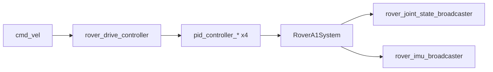
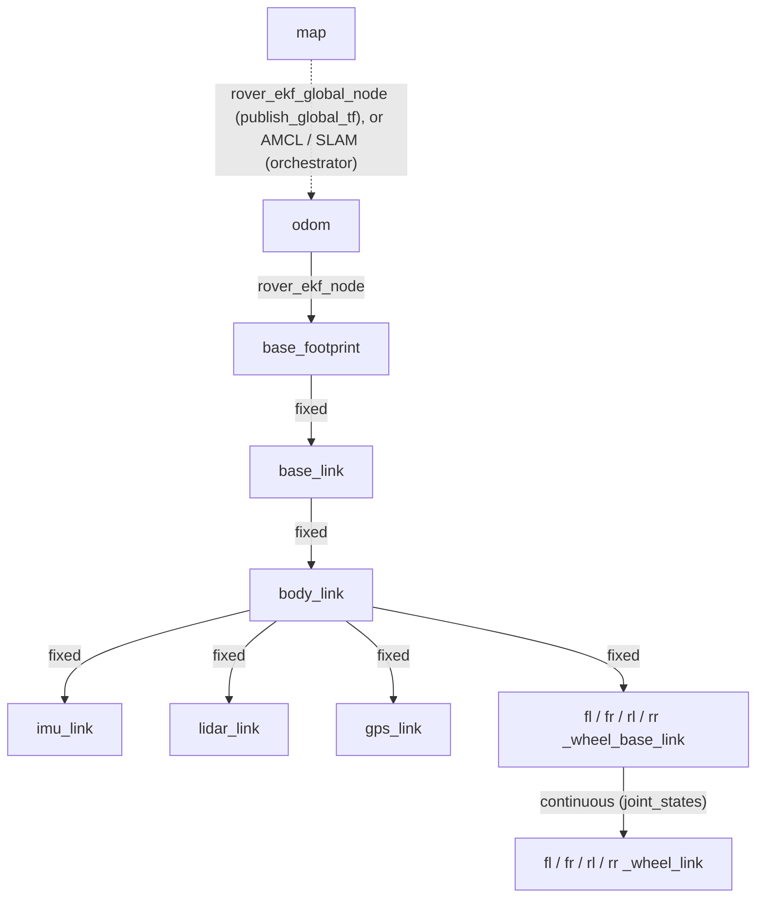

# ROS 2 API

The topics, services and parameters that the Rover A1 platform nodes expose. Each section covers
one node or component. The names here were checked against the launch files, config files and
sources in `rover_ros`.

!!! note "Namespace"
    Every platform node runs in the robot namespace, `rover` by default (`ROVER_SYSTEM_NAMESPACE`). Names
    in the tables are relative to it: `cmd_vel` is `/rover/cmd_vel`. TF frames carry the same
    prefix (`rover/base_link`). The exceptions are `/tf`, `/tf_static`, `/clock` and the web
    bridges, which are not namespaced.

Message types are shortened: `rover_msgs/SafetyStatus` means `rover_msgs/msg/SafetyStatus`.

Topic names carry no `rover_` prefix, even where the node name does. A lifecycle node's
`transition_event` topic is therefore remapped off its node name: `rover_safety_node` publishes
`safety_node/transition_event`. This applies to `rover_safety_node`, `rover_led_safety_node`,
`rover_led_driver`, `rover_crsf_teleop_node`, `rover_crsf_udp_receiver`,
`rover_udp_battery_receiver_node` and `rover_udp_led_channel_<n>_sender_node`. Node names and
their lifecycle services (`rover_safety_node/change_state`) keep the prefix.

## Hardware interface

`rover_hardware_interface` provides two ros2_control plugins that run inside the
`controller_manager` process (`ros2_control_node`). Each component gets its own node,
named after it: `/rover/rover_system_node` and `/rover/rover_imu`.

| `<ros2_control>` component | Plugin | Hardware |
|----------------------------|--------|----------|
| `rover_system_node` (system) | `rover_hardware_interface/RoverA1System` | 4 x Phidget DCC1000 motor controllers; safety PLC over Modbus TCP |
| `rover_imu` (sensor) | `rover_hardware_interface/PhidgetImuSensor` | Phidgets Spatial MOT0110, Madgwick orientation filter |

Command interface per wheel joint: `velocity`. State interfaces: `position`, `velocity`, `effort`.
The IMU exports `imu/orientation.*`, `imu/angular_velocity.*` and `imu/linear_acceleration.*`.

### `rover_hardware_controller`

`RoverA1System` creates this helper node in the `controller_manager` process. It exists on real
hardware only.

**Published topics**

| Name | Type | Description |
|------|------|-------------|
| `hardware_interface/driver_state` | `rover_msgs/RoverDriverState` | Motor driver state per wheel (`rear_left`, `rear_right`, `front_left`, `front_right`). Reliable, volatile, depth 5. |
| `hardware_interface/safety_status` | `rover_msgs/SafetyStatus` | Plant state of the safety chain: HW E-Stop button, contactor feedback, latch, latch cause, link health. Reliable, volatile, depth 1. |
| `hardware_interface/safety_command_echo` | `rover_msgs/SafetyCommandEcho` | Read-back of the coils software drives (SW E-Stop, driver-fault stop, latch reset, watchdog heartbeat). Diagnostic only. Reliable, volatile, depth 1. |
| `hardware_interface/aux_io_state` | `rover_msgs/AuxIoState` | General-purpose aux IO on the PLC (DIO06..11 inputs, DIO00..05 output read-back). Not safety. Reliable, volatile, depth 1. |
| `diagnostics` | `diagnostic_msgs/DiagnosticArray` | Hardware id `Rover System`. Tasks `system errors`, `system status`, `safety plc link`, `command path`, `imu data`. |

**`command path` diagnostic (instrumentation).** Cumulative counters since start, per wheel
(`Front Left`, `Front Right`, `Rear Left`, `Rear Right`), answering "where did a velocity command go
missing between `write()` and the motor?". Compare two reads to get a rate. All counters are lock-free
and never read by the control loop.

| Key (prefixed with the wheel name) | Meaning |
|---|---|
| `commands submitted` | Asynchronous velocity calls actually issued to the Phidget driver. |
| `dropped, previous command still pending` | `sendCmdVel()` returned early because the previous call had not completed. Silent before this task existed. |
| `dropped, driver object gone` | The owning driver no longer existed. Should stay 0. |
| `dropped while pending (%)` | The two above as a share of everything `write()` tried to send. |
| `completed ok` / `completed failsafe-rejected` / `completed with other error` | How the asynchronous calls finished. The third means the command may never have reached the motor. |
| `last non-ok return code` | The last Phidget return code that was not OK, with its meaning, e.g. `0x34 (Phidget not physically attached)` (`none` if there has been none). |
| `completion latency last / mean / max (ms)` | Submit-to-completion time of the asynchronous call. |
| `command in flight now`, `in flight for (ms)` | A call in flight and its age. An age that keeps growing means a completion never arrived. |

System-wide: `write cycles: forwarded motion`, `inhibited, zeros sent`, `skipped, nothing sent`,
`skipped, mutex busy`, `operation threw`.

**Levels.** `ERROR` while driver completions are *still* returning errors (an error counted within
the last 3 s), e.g. the wheel boards are no longer attached after a USB flap. `WARN` for earlier
errors that stopped (with how long ago), a missing driver object or a throwing write. Dropped-while-
pending is ordinary back-pressure and is informational.

**`system status` and `system errors`.** `system status` is `ERROR` while "Communication error"
is true (a wheel driver stopped reporting); it used to stay `OK` whatever it said. `system errors`
now also lists each wheel's last driver return code with its meaning, so "timed out" comes with a
cause.

**`imu data` diagnostic.** Judges `imu/data` itself, because the IMU is a separate hardware
component with no diagnostics: a component that never activated makes the broadcaster publish NaN
at full rate, which the controller_manager's own "Hardware Components Activity" status reports only
as an `OK`-level text. `OK` for valid, fresh data. `WARN` for the first 20 s while waiting for the
first message. `ERROR` for no message after that, a latest message older than 1 s, or a latest
message containing NaN/inf. Keys: messages received / valid / with NaN/inf, message rate since the
last look, and the age of the last message and of the last valid message.

**Services**

| Name | Type | Description |
|------|------|-------------|
| `hardware_interface/sw_user_e_stop_set` | `std_srvs/Trigger` | Set the software E-Stop. |
| `hardware_interface/sw_user_e_stop_reset` | `std_srvs/Trigger` | Reset the software E-Stop. Refused while the wheels are commanded or still turning. |
| `hardware_interface/sw_e_stop_latch_reset` | `std_srvs/Trigger` | Pulse the latch-reset coil of the safety relay. Also clears a latched motor failsafe trip. |
| `hardware_interface/aux_output_<0..5>/set` | `std_srvs/SetBool` | Switch aux output DIO00..05. Replies after the PLC acknowledges. |

**Key parameters** (`<param>` tags of `rover_system_node`)

| Name | Value | Description |
|------|-------|-------------|
| `modbus_host` / `modbus_port` | `192.168.88.11` / `502` | Safety PLC Modbus TCP endpoint. |
| `modbus_response_timeout_ms` | `150` | Timeout of one Modbus transaction. |
| `safety_wdg_kick_period_ms` | `200` | Period of the CPU watchdog heartbeat to the safety relay. |
| `safety_io_poll_period_ms` | `100` | Period of the discrete-IO poll. |
| `safety_latch_reset_pulse_ms` | `100` | Width of the latch-reset pulse. |
| `driver_states_update_frequency` | `20.0` | Driver state update rate [Hz]. |
| `driver_comm_timeout_ms` | `300` | Max age of Phidget telemetry before a driver comm error. |
| `motor_failsafe_timeout_ms` | `500` | Phidget board watchdog: brakes the motor if `write()` stalls. |
| `motor_failsafe_enabled` | `true` | Optional. `false` never arms that watchdog (instrumented builds only): a stalled `write()` then leaves each wheel at its last duty command. Anything but `true`/`false`/`1`/`0` fails `on_init()`. |
| `motor_acceleration` | `2.0` | DCC1000 on-board duty ramp [duty/s]. |
| `motor_current_limit` | `15.0` | DCC1000 current limit [A]. |
| `motor_supply_voltage` | `24.0` | Motor supply [V], used for the current regulator gain. |
| `max_rpm_motor_speed` / `gear_ratio` | `2800` / `23.3` | Motor speed and gearbox ratio. |
| `encoder_resolution` | `1024` | Encoder resolution. |
| `velocity_command_zero_tolerance` | `0.4` | Commanded wheel speed [rad/s] below which E-Stop reset is allowed. |
| `velocity_state_zero_tolerance` | `0.05` | Measured wheel speed [rad/s] below which E-Stop reset is allowed. |

`rover_imu` parameters: `data_interval_ms` `8`, Madgwick `gain` `0.00304`, `zeta` `0.00151`,
`use_mag` `false`, `world_frame` `enu`.

Source: `rover_description/urdf/rover_a1/rover_a1_macro.urdf.xacro`,
`rover_description/urdf/common/imu.urdf.xacro`,
`rover_hardware_interface/src/system_ros_interface/system_ros_interface.cpp`,
`rover_hardware_interface/src/rover_system/rover_system.cpp`,
`rover_hardware_interface/include/rover_hardware_interface/domain/driver.hpp`.
More: [rover_hardware_interface README](https://github.com/RaduPotlog/rover_ros/blob/master/rover_hardware_interface/README.md),
[Safety](../safety.md).

## Controllers

`controller_manager` runs at `update_rate` 25 Hz. Its `/diagnostics` output is remapped to
`diagnostics`. The drive controller writes into four wheel PIDs, which write the hardware:

| Controller | Type | Rate |
|------------|------|------|
| `rover_drive_controller` | `diff_drive_controller/DiffDriveController` | 25 Hz |
| `pid_controller_<wheel>_wheel_base_to_<wheel>_wheel_joint` (`fl`, `fr`, `rl`, `rr`) | `rover_controller/SeededPidController` (chainable, based on `pid_controller/PidController`) | 25 Hz |
| `rover_joint_state_broadcaster` | `joint_state_broadcaster/JointStateBroadcaster` | 25 Hz |
| `rover_imu_broadcaster` | `imu_sensor_broadcaster/IMUSensorBroadcaster` | 25 Hz |

### `rover_drive_controller`

| Direction | Name | Type | Description |
|-----------|------|------|-------------|
| sub | `cmd_vel` | `geometry_msgs/TwistStamped` | Velocity command. Only `rover_twist_mux_node` publishes it. |
| pub | `odometry/wheels` | `nav_msgs/Odometry` | Wheel odometry, `odom` → `base_footprint`, every update. Input of the EKF. |

`enable_odom_tf` is `false`: the EKF publishes the odometry transform, not the drive controller.
`publish_limited_velocity` is `false`.

| Parameter | Value |
|-----------|-------|
| `wheel_separation` / `wheel_radius` | `0.617` m / `0.1651` m |
| `wheel_separation_multiplier` | `1.659` |
| `cmd_vel_timeout` | `0.5` s |
| `linear.x.max_velocity` / `max_acceleration` | `0.95` m/s / `2.7` m/s² |
| `angular.z.max_velocity` / `max_acceleration` | `1.5` rad/s / `3.74` rad/s² |
| `odom_frame_id` / `base_frame_id` | `odom` / `base_footprint` |

!!! warning "Source conflict"
    The controller config `rover_controller/config/wheel_01_controller.yaml` uses
    `wheel_separation_multiplier` `1.659`. Its comment says the multiplier was rescaled to a measured separation of `0.615` m, while
    `wheel_separation` there and in `rover_description/config/wheel_01.yaml` is `0.617` m. This
    page uses the configured values (`1.659`, `0.617` m).

### Wheel PIDs

| Direction | Name | Type | Description |
|-----------|------|------|-------------|
| pub | `pid_controller_<wheel>.../controller_state` | `control_msgs/MultiDOFStateStamped` | Reference, feedback, error and output of one wheel loop. |

Gains are live parameters, the same on all four wheels: `gains.<joint>.p` `0.05`, `.i` `1.0`,
`.d` `0.04`, `.feedforward_gain` `1.0`, `.u_clamp_max` `12.58` rad/s, `.i_clamp_max` `2.0`.
The wheel loop options are live too: `stop_at_zero_reference` `true`, `zero_reference_tolerance`
`0.001` rad/s (default), `integral_reference_delay` `0.15` s (≤ 1.0 s),
`integral_reference_time_constant` `0.08` s, `scale_integral_with_reference` `true`. See
[Drive and control](drive-and-control.md#wheel-pid-controller).

### Broadcasters and robot state publisher

| Node | Direction | Name | Type | Description |
|------|-----------|------|------|-------------|
| `rover_joint_state_broadcaster` | pub | `joint_states` | `sensor_msgs/JointState` | Wheel position, velocity, effort. |
| `rover_imu_broadcaster` | pub | `imu/data` | `sensor_msgs/Imu` | IMU, frame `rover/imu_link`. Static covariances from the controller config. |
| `rover_state_publisher_node` | pub | `robot_description` | `std_msgs/String` | URDF. |
| `rover_state_publisher_node` | pub | `/tf`, `/tf_static` | `tf2_msgs/TFMessage` | Robot frames, with the `rover/` frame prefix. |

The controllers' lifecycle `transition_event` topics are moved under `_<controller>/`.

Source: `rover_controller/config/wheel_01_controller.yaml`,
`rover_controller/launch/rover_controller.launch.py`,
`rover_description/launch/rover_load_urdf.launch.py`.
More: [rover_controller README](https://github.com/RaduPotlog/rover_ros/blob/master/rover_controller/README.md).

## Command arbitration (`rover_twist_mux`)

### `rover_twist_mux_node`

`twist_mux` is the only publisher of `cmd_vel`. Inputs and the lock are `TwistStamped` /
`std_msgs/Bool` (`use_stamped: true`). The highest-priority fresh input wins.

| Direction | Name | Type | Priority | Timeout | Source |
|-----------|------|------|---------:|--------:|--------|
| sub | `teleop_elrs_cmd_vel_stamped` | `geometry_msgs/TwistStamped` | 110 | 0.5 s | RC teleop |
| sub | `teleop_foxglove_cmd_vel_stamped` | `geometry_msgs/TwistStamped` | 100 | 0.5 s | Foxglove joystick (and the Gazebo GUI in simulation) |
| sub | `teleop_driver_interface_cmd_vel_fresh_stamped` | `geometry_msgs/TwistStamped` | 8 | 0.3 s | Driver UI, through `rover_command_freshness_node` |
| sub | `nav_cmd_vel_stamped` | `geometry_msgs/TwistStamped` | 5 | 0.5 s | Nav 2 (orchestrator) |
| sub | `motion_lock` (lock) | `std_msgs/Bool` | 200 | 0.5 s | `rover_motion_lock_node` |
| pub | `cmd_vel` | `geometry_msgs/TwistStamped` | | | To `rover_drive_controller` |
| pub | `diagnostics` | `diagnostic_msgs/DiagnosticArray` | | | twist_mux status |

A lock at priority 200 masks every input. A stale lock counts as locked.

### `rover_motion_lock_node`

| Direction | Name | Type | Description |
|-----------|------|------|-------------|
| sub | `hardware_interface/safety_status` | `rover_msgs/SafetyStatus` | Reliable, volatile, depth 1. |
| sub | `hardware_interface/safety_command_echo` | `rover_msgs/SafetyCommandEcho` | Reliable, volatile, depth 1. |
| pub | `motion_lock` | `std_msgs/Bool` | `true` = motion inhibited. Reliable, depth 1. |
| pub | `diagnostics` | `diagnostic_msgs/DiagnosticArray` | Hardware id `Motion Lock`, task `Motion lock`. |

The lock is closed while any enabled stop condition is active, before both safety topics have
arrived, when either is older than `gpio_timeout`, or when `link_healthy` is false.

| Parameter | Value |
|-----------|-------|
| `publish_frequency` | `10.0` Hz |
| `gpio_timeout` | `1.0` s |
| `use_hw_e_stop_user_button`, `use_sw_e_stop_user_button`, `use_sw_e_stop_motor_driver_fault`, `use_sw_e_stop_latch_status` | `true` |
| `require_motor_contactor_engaged` | `false` |

### `rover_command_freshness_node`

| Direction | Name | Type | Description |
|-----------|------|------|-------------|
| sub | `teleop_driver_interface_cmd_vel_stamped` | `geometry_msgs/TwistStamped` | Driver UI commands (published by `rover_drive_mode` in the orchestrator). |
| pub | `teleop_driver_interface_cmd_vel_fresh_stamped` | `geometry_msgs/TwistStamped` | Commands that arrived on time; the mux input. |
| pub | `diagnostics` | `diagnostic_msgs/DiagnosticArray` | Task `Command freshness`: WARN while dropping. |

Parameters (read-only): `max_delay` `0.3` s, `max_clock_drift` `0.001` s/s, `resync_gap`
`1.0` s, `resync_time` `2.0` s.

Source: `rover_twist_mux/config/*.yaml`, `rover_twist_mux/launch/rover_twist_mux.launch.py`,
`rover_twist_mux/src/infrastructure/motion_lock_node.cpp`, `rover_twist_mux/src/*_params.yaml`.
More: [rover_twist_mux README](https://github.com/RaduPotlog/rover_ros/blob/master/rover_twist_mux/README.md).

## Safety supervision (`rover_safety`)

Both nodes are lifecycle nodes that configure and activate themselves (`autostart_node`) and
retry a failed configure every `configure_retry_period` (5.0 s).

### `rover_safety_node`

| Direction | Name | Type | Description |
|-----------|------|------|-------------|
| sub | `battery/battery_status` | `sensor_msgs/BatteryState` | Battery health and temperature. |
| sub | `hardware_interface/driver_state` | `rover_msgs/RoverDriverState` | Motor driver state. |
| sub | `hardware_interface/safety_command_echo` | `rover_msgs/SafetyCommandEcho` | SW E-Stop echo. |
| sub | `system_status` | `rover_msgs/SystemStatus` | Computer status from `rover_diag_manager_node`. |
| client | `hardware_interface/sw_user_e_stop_set` | `std_srvs/Trigger` | Trips the E-Stop on an unsafe battery and before shutdown. |
| srv | `~/shutdown` | `std_srvs/Trigger` | Shut down the rover computer (`/rover/rover_safety_node/shutdown`). |
| pub | `diagnostics` | `diagnostic_msgs/DiagnosticArray` | Hardware id `Rover Safety`. |

| Parameter | Value |
|-----------|-------|
| `timer_frequency` | `10.0` Hz |
| `battery.temp.critical` / `battery.temp.fatal` | `50.0` / `60.0` °C |
| `input_timeout` | `5.0` s |
| `shutdown.service_enabled` | `true` |
| `shutdown.command_timeout` / `shutdown.retry_backoff` | `15.0` s / `30.0` s |
| `bt_server_port` / `shutdown.bt_server_port` | `6666` / `7777` (Groot2) |

### `rover_led_safety_node`

| Direction | Name | Type | Description |
|-----------|------|------|-------------|
| sub | `battery/battery_status` | `sensor_msgs/BatteryState` | Battery state for the battery animations. |
| sub | `hardware_interface/safety_status` | `rover_msgs/SafetyStatus` | HW E-Stop button for the E-Stop animation. |
| sub | `joy` | `sensor_msgs/Joy` | Dead-man button. Nothing on the platform publishes it. |
| client | `led/set_animation` | `rover_msgs/SetLedAnimation` | Requests animations from `rover_led_controller`. |
| pub | `diagnostics` | `diagnostic_msgs/DiagnosticArray` | Hardware id `Bumper Led`. |

Parameters: `timer_frequency` `10.0` Hz, `battery.percent.threshold.low` `0.4`,
`battery.percent.threshold.critical` `0.1`, `bt_server_port` `5555`.

Source: `rover_safety/src/safety_node.cpp`, `rover_safety/src/led_safety_node.cpp`,
`rover_safety/config/rover_safety.yaml`, `rover_safety/config/led_safety.yaml`.
More: [rover_safety README](https://github.com/RaduPotlog/rover_ros/blob/master/rover_safety/README.md).

## Battery (`rover_battery`)

`rover_battery_container` holds two components with intra-process communication.

| Node | Direction | Name | Type | Description |
|------|-----------|------|------|-------------|
| `rover_udp_battery_receiver_node` | pub | `battery_udp_data` | `udp_msgs/UdpPacket` | Raw BMS packets received on `192.168.1.201:4444`. |
| `rover_battery_node` | sub | `battery_udp_data` | `udp_msgs/UdpPacket` | 392-byte BMS frame. |
| `rover_battery_node` | pub | `battery/battery_status` | `sensor_msgs/BatteryState` | Voltage, current, SoC, charge, hottest temperature, cell voltages. Depth 5. |
| `rover_battery_node` | pub | `battery/charging_status` | `rover_msgs/ChargingStatus` | Charging flag, currents, charger type. Depth 5. |
| `rover_battery_node` | pub | `diagnostics` | `diagnostic_msgs/DiagnosticArray` | Hardware id `RoverBattery`. |

| Parameter | Value | Description |
|-----------|-------|-------------|
| `design_capacity` | `40.0` Ah | Reported design capacity. |
| `serial_number` | `224KA141600043` | Reported serial number. |
| `watchdog_timeout_ms` | `10000` | Without a valid frame for this long, `present: false` and health `WATCHDOG_TIMER_EXPIRE`. |

Source: `rover_battery/config/rover_battery.yaml`, `rover_battery/launch/rover_battery.launch.py`,
`rover_battery/src/infrastructure/*.cpp`.
More: [rover_battery README](https://github.com/RaduPotlog/rover_ros/blob/master/rover_battery/README.md).

## LEDs (`rover_led`)

`rover_led_container` holds the controller, the driver and two UDP senders. The driver and the
senders run on hardware only.

### `rover_led_controller`

| Direction | Name | Type | Description |
|-----------|------|------|-------------|
| srv | `led/set_animation` | `rover_msgs/SetLedAnimation` | Play an animation by id. |
| srv | `led/stop_animation` | `rover_msgs/StopLedAnimation` | Stop an animation. |
| pub | `led/channel_<n>_frame` | `sensor_msgs/Image` | RGBA frame per panel at `controller_frequency`. |
| pub | `led/channel_<n>_preview` | `sensor_msgs/Image` | Same frame at `preview_publish_rate`, best effort, for UIs. |
| pub | `led/animations` | `rover_msgs/LedAnimationCatalog` | Loaded animations. Latched. |
| pub | `led/state` | `rover_msgs/LedState` | What every layer plays. Latched. |
| pub | `diagnostics` | `diagnostic_msgs/DiagnosticArray` | Hardware id `Bumper Led`. |

Parameters: `controller_frequency` `50.0` Hz, `state_publish_rate` `5.0` Hz,
`preview_publish_rate` `5.0` Hz, `animations_config_path` (`config/rover_a1_animations.yaml`).

### `rover_led_driver` (lifecycle)

| Direction | Name | Type | Description |
|-----------|------|------|-------------|
| sub | `led/channel_<n>_frame` | `sensor_msgs/Image` | Frames from the controller. |
| pub | `udp_write/led_channel_<n>` | `udp_msgs/UdpPacket` | SK9822 frame for the UDP sender. |
| srv | `led/set_brightness` | `rover_msgs/SetLedBrightness` | Brightness 0.0 to 1.0. |
| pub | `led/brightness` | `std_msgs/Float32` | Brightness in effect. Latched. |
| client | `hardware/led_control_enable` | `std_srvs/SetBool` | Only with `led_control_handshake: true`. |
| pub | `diagnostics` | `diagnostic_msgs/DiagnosticArray` | Hardware id `Bumper Led`. |

Parameters (`config/rover_a1_driver.yaml`): `frame_timeout` `0.1` s, `global_brightness` `0.5`,
`channel_1_num_led` / `channel_2_num_led` `40`.

### `rover_udp_led_channel_<n>_sender_node`

Subscribes `udp_write/led_channel_<n>` and sends to the LED board: channel 1 →
`192.168.77.202:3334`, channel 2 → `192.168.77.201:3333`.

Source: `rover_led/launch/rover_led.launch.py`, `rover_led/src/infrastructure/*.cpp`,
`rover_led/src/*_parameters.yaml`, `rover_led/config/*.yaml`.
More: [rover_led README](https://github.com/RaduPotlog/rover_ros/blob/master/rover_led/README.md),
[Teleop and LEDs](teleop-and-leds.md).

## RC teleop (`rover_crsf_teleop`)

`rover_crsf_container` holds the UDP receiver and the teleop node, with intra-process
communication. The ELRS receiver is on the RUTX11's USB port; the router forwards its CRSF bytes
over UDP.

### `rover_crsf_udp_receiver` (`rover_udp_driver`, lifecycle)

| Direction | Name | Type | Description |
|-----------|------|------|-------------|
| pub | `rc/raw_udp` | `udp_msgs/UdpPacket` | One CRSF datagram from the router per message. `address`/`src_port` are the bound endpoint. |

Binds `192.168.1.201:10111` and accepts datagrams from `192.168.1.1` only (`source_ip`); all
three come from `udp_bind_ip` / `udp_port` / `udp_source_ip` in the teleop config. Hardware only.

### `rover_crsf_teleop_node` (lifecycle)

| Direction | Name | Type | Description |
|-----------|------|------|-------------|
| sub | `rc/raw_udp` | `udp_msgs/UdpPacket` | CRSF bytes, one datagram per message. Reliable, depth 100. |
| sub | `hardware_interface/safety_status` | `rover_msgs/SafetyStatus` | E-Stop evidence for the calibration interlock. |
| pub | `teleop_elrs_cmd_vel_stamped` | `geometry_msgs/TwistStamped` | Stick command, frame `base_link`. |
| pub | `rc/channels` | `rover_msgs/RcChannels` | Echo of the channel values. Best effort. |
| pub | `rc/link` | `rover_msgs/RcLinkStatus` | Echo of the link statistics. Best effort. |
| pub | `rc/calibration/state` | `rover_msgs/RcCalibrationState` | Calibration progress. Reliable, transient local. |
| pub | `diagnostics` | `diagnostic_msgs/DiagnosticArray` | Hardware id `RC Receiver`. |
| srv | `rc/calibration/start` | `rover_msgs/StartRcCalibration` | Start a calibration session. |
| srv | `rc/calibration/sweep`, `rc/calibration/finish`, `rc/calibration/cancel` | `std_srvs/Trigger` | Calibration steps. |
| srv | `rc/calibration/apply` | `rover_msgs/SetRcCalibration` | Apply (and optionally persist) a calibration. |
| client | `hardware_interface/sw_user_e_stop_set`, `hardware_interface/sw_user_e_stop_reset`, `hardware_interface/sw_e_stop_latch_reset` | `std_srvs/Trigger` | Driven by the RC switches. |

| Parameter | Value |
|-----------|-------|
| `linear_x_channel` / `angular_z_channel` | `3` / `1` |
| `linear_x_out_max` / `angular_z_out_max` | `0.95` m/s / `1.5` rad/s |
| `e_stop_channel` / `e_stop_latch_reset_channel` | `5` / `4` |
| `zero_burst_duration_ms` | `300` |
| `channel_timeout_ms` / `link_stats_timeout_ms` | `200` / `1000` |
| `link_quality_lost_below` / `link_quality_recovered_at` | `30` / `50` |
| `rc_topics_rate_hz` | `25.0` |

Source: `rover_crsf_teleop/launch/rover_crsf_teleop.launch.py`,
`rover_crsf_teleop/config/rover_crsf_teleop.yaml`,
`rover_crsf_teleop/src/infrastructure/rover_crsf_teleop_node.cpp`,
`rover_crsf_teleop/src/infrastructure/ros2_trigger_safety_switch.cpp`.
More: [rover_crsf_teleop README](https://github.com/RaduPotlog/rover_ros/blob/master/rover_crsf_teleop/README.md).

## Localization (`rover_localization`)

`robot_localization` EKFs at 50 Hz in 2D mode. Without GPS only `rover_ekf_node` runs. With
`use_gps:=true` (`ROVER_SYSTEM_USE_GPS=true`) the other three nodes start too.

### `rover_ekf_node`

| Direction | Name | Type | Description |
|-----------|------|------|-------------|
| sub | `odometry/wheels` | `nav_msgs/Odometry` | Fuses vx, vy. |
| sub | `imu/data` | `sensor_msgs/Imu` | Fuses yaw rate. |
| pub | `odom` | `nav_msgs/Odometry` | Filtered odometry (`odometry/filtered`, remapped). |
| pub | `/tf` | `tf2_msgs/TFMessage` | `rover/odom` → `rover/base_footprint`. |
| srv | `localization/set_pose`, `localization/enable`, `localization/toggle` | `robot_localization` services | Reset or pause the filter. |
| pub | `diagnostics` | `diagnostic_msgs/DiagnosticArray` | Filter status. |

### `rover_ekf_global_node` (GPS mode)

| Direction | Name | Type | Description |
|-----------|------|------|-------------|
| sub | `odometry/wheels`, `imu/data` | as above | |
| sub | `odometry/gps` | `nav_msgs/Odometry` | GPS position (X, Y) from navsat_transform. |
| pub | `odometry/global` | `nav_msgs/Odometry` | Filtered pose in `rover/map`. |
| pub | `/tf` | `tf2_msgs/TFMessage` | `rover/map` → `rover/odom`, only with `publish_global_tf:=true` (`ROVER_SYSTEM_GPS_MAP_TF`). |
| srv | `localization/global/set_pose`, `localization/global/enable`, `localization/global/toggle` | `robot_localization` services | |

### `rover_navsat_transform_node` (GPS mode)

| Direction | Name | Type | Description |
|-----------|------|------|-------------|
| sub | `gps/fix` | `sensor_msgs/NavSatFix` | From the sensor payload (or the simulation). |
| sub | `gps/heading_imu` | `sensor_msgs/Imu` | ENU heading from `rover_gps_heading_node`. |
| sub | `odometry/global` | `nav_msgs/Odometry` | Global EKF output. |
| pub | `odometry/gps` | `nav_msgs/Odometry` | GPS position in the map frame. |
| pub | `gps/filtered` | `sensor_msgs/NavSatFix` | Filtered pose as a fix. |
| srv | `localization/datum` | `robot_localization/SetDatum` | Set the datum. |

Parameters: `frequency` `10.0` Hz, `yaw_offset` `0.0`, `zero_altitude` `true`.

Source: `rover_localization/launch/rover_localization.launch.py`,
`rover_localization/config/rel_localization.yaml`,
`rover_localization/config/rel_localization_with_gps.yaml`.
More: [rover_localization README](https://github.com/RaduPotlog/rover_ros/blob/master/rover_localization/README.md).

## GPS heading (`rover_gps_heading_node`)

Started by `rover_localization` in GPS mode.

| Direction | Name | Type | Description |
|-----------|------|------|-------------|
| sub | `gps/fix` | `sensor_msgs/NavSatFix` | Reliable, volatile, depth 10. |
| sub | `odom` | `nav_msgs/Odometry` | Local EKF output. |
| pub | `gps/heading_imu` | `sensor_msgs/Imu` | ENU yaw of `rover/base_link`, only after alignment. |
| srv | `gps/reset_heading_alignment` | `std_srvs/Trigger` | Discard the alignment and collect it again. |
| pub | `diagnostics` | `diagnostic_msgs/DiagnosticArray` | Hardware id `RoverGpsHeading`, task `Heading alignment`. |

Alignment parameters: `alignment.min_segment_length_m` `3.0`, `alignment.min_speed_m_s` `0.3`,
`alignment.required_segments` `3`, `alignment.max_offset_std_rad` `0.1`. The rover must drive
straight for a few metres before `gps/heading_imu` appears.

Source: `rover_gps_heading/src/infrastructure/*.cpp`,
`rover_localization/config/rel_localization_with_gps.yaml`.
More: [rover_gps_heading README](https://github.com/RaduPotlog/rover_ros/blob/master/rover_gps_heading/README.md).

## Diagnostics (`rover_diag_manager`)

### `rover_diag_manager_node`

| Direction | Name | Type | Description |
|-----------|------|------|-------------|
| pub | `system_status` | `rover_msgs/SystemStatus` | CPU usage and temperature, load, RAM and disk usage. |
| pub | `diagnostics` | `diagnostic_msgs/DiagnosticArray` | Hardware id `Rover PC`, task `OS status`. |

Parameters: `publish_frequency` `5.0` Hz; WARN thresholds `cpu_usage_warn_threshold` `95.0` %,
`cpu_temperature_warn_threshold` `80.0` °C, `ram_usage_warn_threshold` `90.0` %,
`disk_usage_warn_threshold` `90.0` %.

### `rover_diagnostic_aggregator`

| Direction | Name | Type | Description |
|-----------|------|------|-------------|
| sub | `diagnostics` | `diagnostic_msgs/DiagnosticArray` | All platform nodes. |
| pub | `diagnostics_agg` | `diagnostic_msgs/DiagnosticArray` | Grouped under `/Rover/{Computer, Drive, Battery, Localization, GPS, Lidar, Lighting, Teleop, Motion, Safety}`; GPS and Lidar only while `ROVER_SYSTEM_USE_GPS` / `ROVER_SYSTEM_USE_LIDAR` is on. |
| pub | `diagnostics_toplevel_state` | `diagnostic_msgs/DiagnosticStatus` | Overall state. |

`pub_rate` is `1.0` Hz. Statuses from nodes not listed in the config go to `Other`.

Source: `rover_diag_manager/launch/system_diag.launch.py`, `rover_diag_manager/config/*.yaml`,
`rover_diag_manager/src/infrastructure/*.cpp`.
More: [rover_diag_manager README](https://github.com/RaduPotlog/rover_ros/blob/master/rover_diag_manager/README.md).

## Web bridges

`rover_web_bridges.launch.py` starts three nodes outside the robot namespace. They see the whole
graph.

| Node | Package | Port | Notes |
|------|---------|------|-------|
| `rover_foxglove_bridge` | `foxglove_bridge` | 8765 | Advertises only allow-listed topics and services (below). `sysinfo` off. |
| `rover_rosbridge_websocket` | `rosbridge_server` | 9090 | For rosbridge clients. |
| `rosapi` | `rosapi` | | Serves `/rosapi/*`. |

The Foxglove bridge allow-lists `/tf`, `/tf_static` and these namespaced topics, among others:
`hardware_interface/safety_status`, `hardware_interface/safety_command_echo`,
`hardware_interface/aux_io_state`, `motion_lock`, `battery/battery_status`,
`battery/charging_status`, `diagnostics_agg`, `led/animations`, `led/state`,
`led/brightness`, `led/channel_<n>_preview`, `rc/channels`, `rc/link`, `rc/calibration/state`.
Allow-listed services include the E-Stop and aux-output services, `led/set_animation`,
`led/stop_animation`, `led/set_brightness` and `rc/calibration/*`. Set `ROVER_PLATFORM_FOXGLOVE_TOPIC_WHITELIST="['.*']"` or
`ROVER_PLATFORM_FOXGLOVE_SERVICE_WHITELIST="['.*']"` to open it up for debugging.

Source: `rover_bringup/launch/rover_web_bridges.launch.py`, `rover_bringup/README.md` (port 8765).

## Custom interfaces (`rover_msgs`)

### Messages

| Message | Purpose |
|---------|---------|
| `SafetyStatus` | Plant state of the safety chain (HW E-Stop, contactor, latch, link health). |
| `SafetyCommandEcho` | Read-back of the safety coils software drives. |
| `AuxIoState` | Aux digital IO of the safety PLC. Not safety. |
| `RoverDriverState` | Motor driver states (`DriverStateNamed[]`) and an overall error. |
| `DriverStateNamed` | One named driver state. |
| `DriverState` | Current, temperature, fault flags, runtime errors, timeouts of one driver. |
| `FaultFlag` | Driver fault bits. |
| `RuntimeError` | Driver runtime error bits. |
| `ChargingStatus` | Charging flag, currents, charger type. |
| `SystemStatus` | Computer CPU, temperature, RAM and disk. |
| `LedAnimation` | Animation id (named constants) and parameter. |
| `LedAnimationCatalog`, `LedAnimationInfo` | Animations loaded by the LED controller. |
| `LedState`, `LedSegmentState`, `LedLayerState` | What each LED layer of each segment plays. |
| `LedImageAnimation` | Image animation description. |
| `LedAnimationQueue` | Queued animation names. Not used. |
| `RcChannels` | Raw CRSF channel values. |
| `RcLinkStatus` | CRSF link statistics. |
| `RcCalibration`, `RcCalibrationState` | Per-channel RC calibration and session progress. |
| `DriveMode`, `MissionState`, `LocalizationState`, `MapInfo`, `MapList`, `Place`, `PlaceList` | Used by orchestrator nodes (driving mode, missions, indoor maps). |

### Services

| Service | Purpose |
|---------|---------|
| `SetLedAnimation` | Play an LED animation. |
| `StopLedAnimation` | Stop an LED animation. |
| `SetLedBrightness` | Set LED brightness. |
| `SetLedImageAnimation` | Image animation request. Not served by any node. |
| `StartRcCalibration` | Start an RC calibration (needs the E-Stop engaged). |
| `SetRcCalibration` | Apply an RC calibration. |
| `SetDriveMode`, `SetMission`, `SaveMap`, `LoadMap`, `DeleteMap`, `SavePlace`, `DeletePlace` | Served by orchestrator nodes. |

Source: `rover_msgs/msg/`, `rover_msgs/srv/`.
More: [rover_msgs README](https://github.com/RaduPotlog/rover_ros/blob/master/rover_msgs/README.md).

## Launch files

| Package | Launch file | Key arguments |
|---------|-------------|---------------|
| `rover_bringup` | `rover_bringup.launch.py` | `namespace`, `log_level`, `use_gps`, `common_dir_path`, `disable_manager`, `exit_on_wrong_hw`, `controllers_ready_timeout` |
| `rover_bringup` | `rover_web_bridges.launch.py` | none (environment `ROVER_PLATFORM_FOXGLOVE_*_WHITELIST`) |
| `rover_controller` | `rover_controller.launch.py` | `namespace`, `use_sim`, `robot_model`, `wheel_type`, `controller_config_path`, `extra_controller_config_path`, `common_dir_path`, `log_level` (default `DEBUG`) |
| `rover_description` | `rover_load_urdf.launch.py` | `controller_config_path` (required), `namespace`, `robot_model`, `use_sim`, `wheel_type`, `wheel_config_path`, `publish_robot_state` |
| `rover_description` | `rover_rviz.launch.py` | `rviz_config`, `namespace`, `use_sim` |
| `rover_twist_mux` | `rover_twist_mux.launch.py` | `namespace`, `log_level`, `twist_mux_config_path`, `motion_lock_config_path`, `command_freshness_config_path` |
| `rover_safety` | `rover_safety.launch.py` | `namespace`, `use_sim`, `log_level`, `led_bt_project_path`, `safety_bt_project_path`, `shutdown_hosts_config_path`, `common_dir_path` |
| `rover_battery` | `rover_battery.launch.py` | `namespace`, `log_level`, `rover_battery_config_path` |
| `rover_led` | `rover_led.launch.py` | `namespace`, `robot_model`, `animations_config_path`, `common_dir_path`, `use_sim`, `log_level` |
| `rover_crsf_teleop` | `rover_crsf_teleop.launch.py` | `namespace`, `use_sim`, `common_dir_path`, `rover_crsf_config_path`, `log_level` |
| `rover_localization` | `rover_localization.launch.py` | `use_ekf` (default `False`), `fuse_gps`, `publish_global_tf`, `localization_mode`, `localization_config_path`, `namespace`, `use_sim`, `common_dir_path`, `log_level` |
| `rover_diag_manager` | `system_diag.launch.py` | `namespace`, `log_level`, `system_diag_config_path`, `diagnostic_aggregator_config_path` |
| `rover_gazebo` | `simulation.launch.py` | `namespace`, `use_rviz`, `gz_gui`, `log_level` (see [Simulation](simulation.md)) |
| `rover_world` | `rover_world.launch.py` | `gz_world`, `gz_gui`, `gz_headless_mode`, `gz_log_level` |

Source: the launch files listed.

## TF tree

All frames carry the `rover/` prefix (`frame_prefix` of `rover_state_publisher_node` and
`tf_prefix` of the EKFs).

`base_footprint` is the root of the URDF, on the ground plane. `base_link` coincides with
`body_link`. The IMU, lidar and GNSS mount poses come from the `ROVER_SYSTEM_MOUNT_IMU_*`, `ROVER_SYSTEM_MOUNT_LIDAR_*` and
`ROVER_SYSTEM_MOUNT_GPS_*` environment variables. The IMU default is `-0.09 0.0 0.2` m with roll `3.14159`
rad; lidar and GNSS default to the `body_link` origin. In simulation an optional static
`world` → `rover/odom` transform is added (`add_world_transform:=True`).

Source: `rover_description/urdf/rover_a1/base.urdf.xacro`,
`rover_description/urdf/common/wheel.urdf.xacro`,
`rover_description/launch/rover_load_urdf.launch.py`,
`rover_localization/config/rel_localization*.yaml`,
`rover_gazebo/launch/include/simulate_robot.launch.py`.
