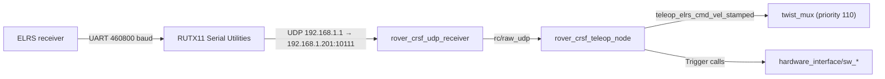

# Teleop and LEDs

This page covers the two operator-facing interfaces of the platform: driving by RC transmitter or Foxglove, and the front and rear LED panels. Safety behaviour (E-Stop chain, reset steps, the LED status gallery) is in [Safety](../safety.md).

ROS names on this page are relative to the robot namespace `rover`. For example, `rc/link` is `/rover/rc/link`.

## ELRS / CRSF RC teleop

`rover_crsf_teleop` turns an ExpressLRS (CRSF) receiver into velocity commands and E-Stop switches.

### Hardware link

The receiver connects to the RUTX11 router's USB port through a USB-UART adapter, not to the ROS controller computer. The router's Serial Utilities ("Over IP", UDP, Client mode, raw mode) read the UART and send the raw CRSF bytes as UDP datagrams to the controller. `rover_crsf_udp_receiver` (`rover_udp_driver`, `rover_transport`) owns the socket and publishes each datagram on `rc/raw_udp`; `rover_crsf_teleop_node` decodes CRSF from them. Both run as components in one container, `rover_crsf_container`.



| Parameter | Value | Note |
|---|---|---|
| Router serial baud rate | 460800 8N1 | Set on the router. What the A1's receiver is flashed for. |
| `udp_bind_ip` / `udp_port` | `192.168.1.201` / `10111` | Where the router sends the datagrams |
| `udp_source_ip` | `192.168.1.1` | The receiver drops datagrams from any other source. CRSF is unauthenticated. |
| Measured packet rate | ~243 Hz (ELRS 250 Hz mode) | `rc_channels_expected_hz` 250.0 |

Source: `rover_crsf_teleop/config/rover_crsf_teleop.yaml`, `rover_crsf_teleop/README.md`, `rover_crsf_teleop/launch/rover_crsf_teleop.launch.py`, `rover_crsf_teleop/scripts/rutx11_elrs_udp_forwarding.sh`.

### Channel map

Channel N is `channels[N-1]` on `rc/channels`.

| Channel | Function | Range / behaviour |
|---|---|---|
| 3 | Linear velocity `linear.x` | −0.95 to 0.95 m/s, expo 0.3 |
| 1 | Angular velocity `angular.z` | −1.5 to 1.5 rad/s, inverted, expo 0.5 |
| 5 | SW user E-Stop | low = `sw_user_e_stop_set`, high = `sw_user_e_stop_reset` |
| 4 | Latch reset | low = `sw_e_stop_latch_reset` |

- A switch counts as low below `channel_switch_threshold` (500 raw counts). Only a change of position fires a call. The resting position is learned over `switch_settle_frames` (100 ticks, 2 s) at start-up and never fires.
- Expo shapes the stick as (1 − e)·m + e·m³. Keep the transmitter's own expo at 0 %; the two stack.
- Stick commands whose outer-wheel rim speed would exceed `max_wheel_rim_speed` (1.7 m/s) are scaled down as a whole, so the rover drives the requested arc more slowly.
- A centred stick (inside `channel_deadband`, 30 counts shipped) maps to exactly zero. After a stop the node publishes zeros for `zero_burst_duration_ms` (300 ms) and then goes silent, so an idle transmitter does not hold the mux.
- There is no arm switch and no speed-mode switch in the code.

The control loop runs every 20 ms. The node is a lifecycle node and the launch file activates it automatically.

Source: `rover_crsf_teleop/config/rover_crsf_teleop.yaml`, `rover_crsf_teleop/README.md`.

### RC link failsafe

The link is healthy while all of these hold:

| Condition | Parameter | Value |
|---|---|---|
| A frame arrived recently | `channel_timeout_ms` | 200 ms |
| Link statistics arrived recently (`require_link_stats: true`) | `link_stats_timeout_ms` | 1000 ms |
| Uplink link quality not lost | `link_quality_lost_below` / `link_quality_recovered_at` | 30 % / 50 % |

When the link is lost, the node publishes a zero burst and goes silent. The rover stops and `twist_mux` falls through to the next input. **The E-Stop is not triggered**, and switch positions are ignored until the link returns. These values are marked as initial values to tune on the rover.

Diagnostics use hardware id `RC Receiver` (`RC UDP link`, `RC link`, `RC channels rate`, `RC calibration`) and never report ERROR, because RC teleop is optional.

Source: `rover_crsf_teleop/config/rover_crsf_teleop.yaml`, `rover_crsf_teleop/README.md`.

### Interfaces

| Direction | Name | Type |
|---|---|---|
| sub | `rc/raw_udp` | `udp_msgs/UdpPacket` (from `rover_crsf_udp_receiver`) |
| sub | `hardware_interface/safety_status` | `rover_msgs/SafetyStatus` (calibration gate) |
| pub | `teleop_elrs_cmd_vel_stamped` | `geometry_msgs/TwistStamped`, frame `base_link` |
| pub | `rc/channels` | `rover_msgs/RcChannels`, capped at `rc_topics_rate_hz` (25 Hz) |
| pub | `rc/link` | `rover_msgs/RcLinkStatus`, capped at 25 Hz |
| pub | `rc/calibration/state` | `rover_msgs/RcCalibrationState` (transient local) |
| srv | `rc/calibration/start` | `rover_msgs/StartRcCalibration` |
| srv | `rc/calibration/sweep`, `finish`, `cancel` | `std_srvs/Trigger` |
| srv | `rc/calibration/apply` | `rover_msgs/SetRcCalibration` |
| client | `hardware_interface/sw_user_e_stop_set`, `_reset`, `sw_e_stop_latch_reset` | `std_srvs/Trigger` |

`rc/channels` and `rc/link` are echoes for tuning. Nothing on the rover consumes them.

Source: `rover_crsf_teleop/README.md`, `rover_crsf_teleop/src/infrastructure/rover_crsf_teleop_node.cpp`.

### RC calibration

Stick centre, endpoints and deadband are stored per channel. The node measures them itself. A calibration is allowed only when the rover is safely stopped: the node checks `hardware_interface/safety_status` and refuses unless the **hardware E-Stop button is pressed, the latch is set and the contactor is open**. A software E-Stop does not count. Without a running hardware interface, calibration is refused.

1. Press the hardware E-Stop button.
2. Deactivate the teleop node:

    ```bash
    ros2 lifecycle set /rover/rover_crsf_teleop_node deactivate
    ```

3. Start the session and confirm the E-Stop:

    ```bash
    ros2 service call /rover/rc/calibration/start rover_msgs/srv/StartRcCalibration "{e_stop_confirmed: true}"
    ```

4. Release every stick while the centre is sampled. Watch `rc/calibration/state`.
5. Call `rc/calibration/sweep`, then move every stick and switch to both ends.
6. Call `rc/calibration/finish` to review, then `rc/calibration/apply`. An all-zero calibration in the request applies what was measured; set `persist: true` to save it:

    ```bash
    ros2 service call /rover/rc/calibration/sweep std_srvs/srv/Trigger
    ros2 service call /rover/rc/calibration/finish std_srvs/srv/Trigger
    ros2 service call /rover/rc/calibration/apply rover_msgs/srv/SetRcCalibration "{persist: true}"
    ```

7. Activate the node again (`ros2 lifecycle set /rover/rover_crsf_teleop_node activate`). The E-Stop switch is inert for 2 s afterwards while it re-learns its resting position.

| Parameter | Value | Note |
|---|---|---|
| `calibration_file` | `/config/rover_crsf_teleop/rc_calibration.yaml` | Overrides the shipped `channel_in_*` values per channel. Delete it to return to them. |
| `calibration_timeout_s` | 300 s | An abandoned session cancels itself |
| `e_stop_state_timeout_s` | 1.0 s | Older safety state counts as "cannot verify" and refuses |
| `e_stop_grace_s` | 1.0 s | Releasing the E-Stop for longer cancels the session |

Shipped defaults are the nominal CRSF endpoints: min 172, mid 992, max 1811 on all 16 channels.

Source: `rover_crsf_teleop/README.md`, `rover_crsf_teleop/config/rover_crsf_teleop.yaml`, `rover_crsf_teleop/src/infrastructure/rover_crsf_teleop_node.cpp`.

!!! warning "The router is in the RC path"
    A router reboot, a firmware update, a Serial Utilities reload or a pulled controller–router cable looks like a lost RC link: a zero burst, then `twist_mux` falls through to the next source. The E-Stop is not triggered. The `RC UDP link` diagnostic shows when no datagrams arrive. Nothing needs to be cycled afterwards.

Details: [rover_crsf_teleop README](https://github.com/RaduPotlog/rover_ros/blob/master/rover_crsf_teleop/README.md).

## Foxglove

`rover_foxglove/rover_a1_foxglove_dashboard_rover_namespace.json` is a Foxglove layout for a rover in the `rover` namespace. Import it in Foxglove and connect to the bridge.

| Item | Value |
|---|---|
| Bridge node | `rover_foxglove_bridge` (`foxglove_bridge`), started by `rover_bringup/launch/rover_web_bridges.launch.py` |
| WebSocket port | 8765 |
| Connection URL | `ws://<rover IP>:8765` (rover IP: see [IO and network](../hardware/io-and-network.md)) |

The layout contains:

- **Safety indicators:** SW E-Stop button, latch status, HW E-Stop button, watchdog heartbeat, motor-driver fault, contactor engaged, motion lock.
- **E-Stop buttons:** service calls to `hardware_interface/sw_user_e_stop_set`, `sw_user_e_stop_reset` and `sw_e_stop_latch_reset`.
- **Virtual joystick** publishing on `teleop_foxglove_cmd_vel_stamped` (mux priority 100, still gated by the motion lock).
- **Battery gauges** (temperature, current, percentage), wheel speed plot, CPU load plot, 3D robot model, GPS map, LED panel frames, motor driver state, diagnostics and log panels.

Source: `rover_foxglove/rover_a1_foxglove_dashboard_rover_namespace.json`, `rover_bringup/README.md`.

!!! warning "Topic whitelist"
    `rover_foxglove_bridge` advertises only the topics in `FOXGLOVE_TOPIC_WHITELIST` in `rover_bringup/launch/rover_web_bridges.launch.py`. Several topics the layout uses are not on it, among them `teleop_foxglove_cmd_vel_stamped`, `joint_states`, `robot_description`, `system_status`, `diagnostics`, `led/channel_<n>_frame`, `gps/fix` and `hardware_interface/driver_state`. Those panels may stay empty. For a full Foxglove session, set `ROVER_PLATFORM_FOXGLOVE_TOPIC_WHITELIST="['.*']"` (and `ROVER_PLATFORM_FOXGLOVE_SERVICE_WHITELIST="['.*']"` if needed) on the platform service. Every topic a client subscribes to then crosses the Zenoh router at full rate.

## LED panels

The rover has two SK9822 LED panels, front and rear bumper. Each is 2 rows × 20 LEDs (40 LEDs). `rover_led_controller` renders layered image animations; `rover_led_driver` encodes them and two UDP sender nodes send them to the LED boards.

| Panel | Channel | LEDs | UDP target |
|---|---|---|---|
| Front bumper | 1 | 40 | `192.168.77.202:3334` |
| Rear bumper | 2 | 40 | `192.168.77.201:3333` |

Source: `rover_led/config/rover_a1_animations.yaml`, `rover_led/config/rover_a1_driver.yaml`, `rover_led/config/rover_a1_udp_led_channel_1.yaml`, `rover_led/config/rover_a1_udp_led_channel_2.yaml`.

### Services and topics

| Direction | Name | Type | Note |
|---|---|---|---|
| srv | `led/set_animation` | `rover_msgs/SetLedAnimation` | `animation.id`, `animation.param`, `repeating` |
| srv | `led/stop_animation` | `rover_msgs/StopLedAnimation` | Clears one animation id from its layer |
| srv | `led/set_brightness` | `rover_msgs/SetLedBrightness` | 0.0 to 1.0, shipped value 0.5 |
| pub | `led/brightness` | `std_msgs/Float32` | Latched, brightness in effect |
| pub | `led/state` | `rover_msgs/LedState` | Latched, 5 Hz, what each layer plays |
| pub | `led/animations` | `rover_msgs/LedAnimationCatalog` | Latched catalog |
| pub | `led/channel_<n>_frame` | `sensor_msgs/Image` (`rgba8`) | 50 Hz, feeds the driver |
| pub | `led/channel_<n>_preview` | `sensor_msgs/Image` | 5 Hz, for UIs |

```bash
ros2 service call /rover/led/set_animation rover_msgs/srv/SetLedAnimation \
  "{animation: {id: 17, param: ''}, repeating: true}"
ros2 service call /rover/led/stop_animation rover_msgs/srv/StopLedAnimation "{id: 17}"
ros2 service call /rover/led/set_brightness rover_msgs/srv/SetLedBrightness "{data: 0.5}"
ros2 topic echo /rover/led/state
```

Source: `rover_led/README.md`, `rover_led/src/led_controller_parameters.yaml`, `rover_led/config/rover_a1_driver.yaml`, `rover_msgs/srv/`.

### Layers

Every bumper has four layers. A higher layer covers lower ones where its pixels are not transparent.

| Priority | Layer | Behaviour |
|---:|---|---|
| 0 | `ERROR` | Top. Single animation, optionally repeating. |
| 1 | `ALERT` | FIFO queue, never repeats. |
| 2 | `INFO` | Single animation, optionally repeating. |
| 3 | `STATE` | Bottom. Single animation, optionally repeating. |

### Animation catalog

Ids are the `rover_msgs/LedAnimation` constants. Images for the safety and battery animations are in the [Safety LED gallery](../safety.md#led-status).

| Id | Name | Layer | Requested by `rover_safety` | Preview (front) |
|---:|---|---|---|---|
| 0 | `E_STOP` | STATE | yes | see Safety |
| 1 | `READY` | STATE | yes | see Safety |
| 2 | `ERROR` | ERROR | yes | see Safety |
| 3 | `NO_ERROR` | ERROR | yes | blank |
| 4 | `MANUAL_ACTION` | STATE | yes (needs `joy`) | see Safety |
| 5 | `LOW_BATTERY` | INFO | yes | see Safety |
| 6 | `CRITICAL_BATTERY` | INFO | yes | see Safety |
| 7 | `CHARGING_BATTERY` | INFO | yes | see Safety |
| 8 | `BATTERY_CHARGED` | INFO | yes | see Safety |
| 9 | `CHARGER_INSERTED` | ALERT | yes | see Safety |
| 10 | `BATTERY_NOMINAL` | INFO | yes | blank |
| 11 | `AUTONOMOUS_READY` | STATE | no | { width="46" height="120" style="background:#222" } |
| 12 | `AUTONOMOUS_ACTION` | STATE | no | { width="46" height="120" style="background:#222" } |
| 13 | `GOAL_ACHIEVED` | ALERT | no | { width="46" height="120" style="background:#222" } |
| 14 | `BLINKER_LEFT` | ALERT | no | { width="50" height="120" style="background:#222" } |
| 15 | `BLINKER_RIGHT` | ALERT | no | same image, other side |
| 16 | `GOAL_FAILED` | ALERT | no | { width="46" height="120" style="background:#222" } |
| 17 | `FLOOD_LIGHT` | STATE | no | { width="46" height="120" style="background:#222" } |

Ids 11 to 17 are available to other software (for example the navigation stack in other repositories). Nothing in this repository requests them. To add an animation, add an entry with a new id to `rover_led/config/rover_a1_animations.yaml` and, for named callers, a constant to `rover_msgs/msg/LedAnimation.msg`.

Source: `rover_led/config/rover_a1_animations.yaml`, `rover_msgs/msg/LedAnimation.msg`, images from `rover_led/animations/rover_a1/`.

### How rover_safety picks animations

`rover_led_safety_node` runs the `RoverLedSafety` behavior tree at 10 Hz. Three channels request animations independently, and the `rover_led` layers decide what is visible:

| Channel | Input | Result |
|---|---|---|
| State | `hardware_interface/safety_status` (`hw_e_stop_user_button`), `joy` dead-man button | `E_STOP`, else `MANUAL_ACTION`, else `READY` |
| Error | `battery/battery_status` | `ERROR` when status is `UNKNOWN` or charging while `OVERHEAT`, else `NO_ERROR` |
| Battery | `battery/battery_status` | Charging: `CHARGER_INSERTED`, then `CHARGING_BATTERY` or `BATTERY_CHARGED`. Discharging: `CRITICAL_BATTERY` below 10 %, `LOW_BATTERY` below 40 % (every 30 s), else `BATTERY_NOMINAL` |

The tree requests an animation only when it changes. The node is an indicator only and is not part of the E-Stop chain. It also runs in simulation.

!!! note
    The state channel follows the hardware E-Stop button only. A software E-Stop or a held latch leaves `READY` on the LEDs. Nothing in this repository publishes `joy`, so `MANUAL_ACTION` is not shown without an added joystick driver.

Source: `rover_safety/README.md`, `rover_safety/behavior_trees/rover_led_safety.xml`, `rover_safety/config/led_safety.yaml`, `rover_safety/src/led_safety_node.cpp`.

## Further reading

- [rover_led README](https://github.com/RaduPotlog/rover_ros/blob/master/rover_led/README.md)
- [rover_safety README](https://github.com/RaduPotlog/rover_ros/blob/master/rover_safety/README.md)
- [rover_bringup README](https://github.com/RaduPotlog/rover_ros/blob/master/rover_bringup/README.md)
